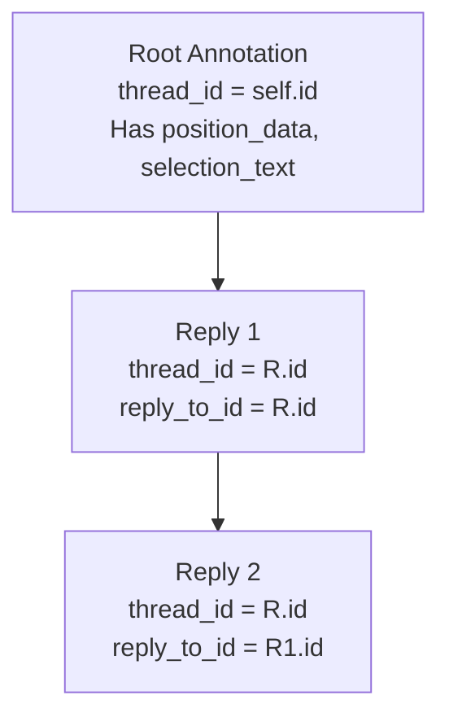
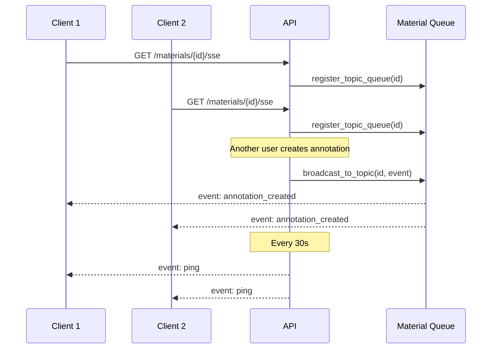

# Annotations

Annotations are position-anchored discussions on materials — similar to Google Docs comments. Users can highlight text in a document and start threaded conversations. Changes are broadcast in real-time via Server-Sent Events.

**Key files**: `api/app/routers/annotations.py`, `api/app/services/annotation.py`, `api/app/core/sse.py`, `api/app/models/annotation.py`, `api/app/schemas/annotation.py`

---

## Threading Model



- **Root annotations**: `thread_id == own id`. Must have `position_data` (coordinates in the document).
- **Replies**: `thread_id` points to the root annotation, `reply_to_id` points to the direct parent. No `position_data` required.
- Deleting a root annotation cascades to all replies in the thread.

---

## Endpoints

### GET `/api/materials/{material_id}/annotations`

**Query params**: `version` (int, optional), `docPage` (int, optional), `page`, `limit`

Returns threads (root + replies) in a paginated response:

```json
{
  "items": [
    {
      "root": {
        "id": "uuid", "material_id": "uuid", "version_id": "uuid",
        "author_id": "uuid",
        "author": {"id": "uuid", "display_name": "Alice", "avatar_url": null},
        "body": "This formula is incorrect",
        "page": 3, "selection_text": "x^2 + y^2 = r",
        "position_data": {"startOffset": 120, "endOffset": 135, "textContent": "x^2 + y^2 = r"},
        "thread_id": "uuid", "reply_to_id": null,
        "created_at": "...", "updated_at": "..."
      },
      "replies": [
        {
          "id": "uuid", "body": "Good catch, fixing now",
          "thread_id": "root-uuid", "reply_to_id": "root-uuid", ...
        }
      ]
    }
  ],
  "total": 5, "page": 1, "pages": 1
}
```

The service fetches root annotations first (where `thread_id == id`), then batch-loads all replies for those roots.

### POST `/api/materials/{material_id}/annotations`

**Auth**: OnboardedUser required.

**Request** (`AnnotationCreateIn`):
```json
{
  "body": "This section needs updating",
  "selection_text": "highlighted text from document",
  "position_data": {"startOffset": 0, "endOffset": 30, "textContent": "..."},
  "page": 2,
  "reply_to_id": null
}
```

**Logic**:
1. Fetch current material version (annotation is pinned to it)
2. If `reply_to_id` is set: validate target exists and belongs to same material, extract `thread_id`
3. If root: validate `position_data` is provided
4. Create `Annotation` record
5. If replying to someone else: notify the reply target's author
6. Broadcast `annotation_created` event to all SSE watchers

**Response**: `AnnotationOut` (201 Created)

### PATCH `/api/annotations/{annotation_id}`

**Auth**: Required (author only). Updates the `body` field.

### DELETE `/api/annotations/{annotation_id}`

**Auth**: Required (author or moderator — MEMBER/BUREAU/VIEUX roles).

If deleting a root annotation, all replies in the thread are deleted first. Broadcasts `annotation_deleted` event.

---

## Real-Time SSE

### GET `/api/materials/{material_id}/sse`

Opens a Server-Sent Events stream for live annotation updates.



**Architecture** (in `api/app/core/sse.py`):
- `_topic_queues: Dict[topic → list[asyncio.Queue]]` — module-level state
- `register_topic_queue(topic)` → creates and returns a new `asyncio.Queue`
- `unregister_topic_queue(topic, queue)` → removes queue from list
- `broadcast_to_topic(topic, event)` → puts event in all registered queues (fire-and-forget)
- `sse_event_stream(queue, cleanup)` → reusable async generator shared with the notifications SSE endpoint

**Events**:
- `annotation_created` — data contains the full annotation
- `annotation_deleted` — data contains annotation_id and material_id
- `ping` — keepalive every 30 seconds
- `close` — sent when connection should terminate

The SSE endpoint uses `sse-starlette`'s `EventSourceResponse`, yielding events from the queue with a 30-second timeout for keepalive pings.
