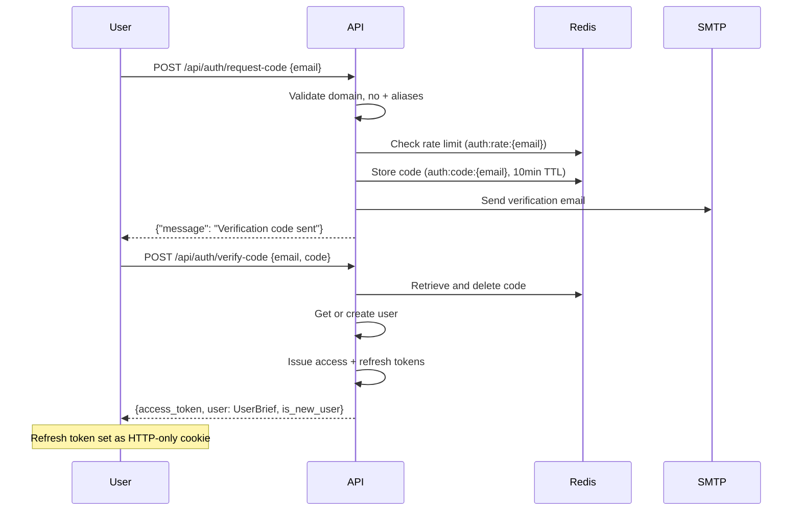
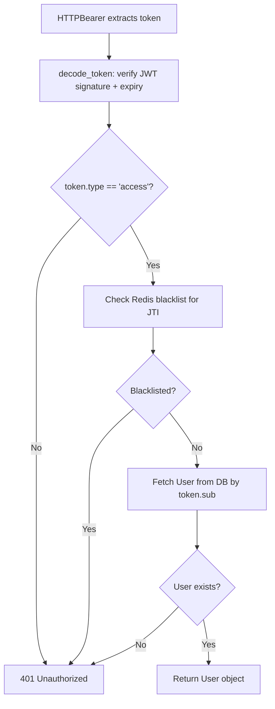

# Authentication

WikINT uses passwordless email-based authentication. Users receive a 6-digit verification code at their school email, then exchange it for JWT tokens. Only `@telecom-sudparis.eu` and `@imt-bs.eu` domains are accepted.

**Key files**: `api/app/routers/auth.py`, `api/app/services/auth.py`, `api/app/core/security.py`, `api/app/dependencies/auth.py`

---

## Login Flow



---

## Endpoints

### POST `/api/auth/request-code`

**Request**: `{"email": "user@telecom-sudparis.eu"}`

**Rate limiting**: 3 requests per 15 minutes per email (production). 10000/min in dev mode.

**Validation** (`api/app/services/auth.py:validate_email`):
- Strip and lowercase
- Reject `+` aliases (e.g., `user+test@...`)
- Must end with `@telecom-sudparis.eu` or `@imt-bs.eu`

**Logic**:
1. Check rate limit via Redis key `auth:rate:{email}` (pipeline: INCR + EXPIRE)
2. Generate 6-digit zero-padded code (`random.randint(0, 999999)`)
3. Store in Redis at `auth:code:{email}` with 600s TTL
4. Send HTML email via `api/app/services/email.py:send_verification_code`

**Response**: `{"message": "Verification code sent"}`

### POST `/api/auth/verify-code`

**Request**: `{"email": "user@telecom-sudparis.eu", "code": "123456"}`

**Dev bypass**: Code `"000000"` always succeeds when `settings.is_dev`.

**Logic**:
1. Retrieve code from Redis `auth:code:{email}`
2. Compare and delete on match
3. `get_or_create_user()`: find existing non-deleted user or create new STUDENT
4. Update `last_login_at`
5. Issue tokens via `api/app/core/security.py`

**Response**:
```json
{
  "access_token": "eyJ...",
  "user": {
    "id": "uuid",
    "email": "user@telecom-sudparis.eu",
    "display_name": null,
    "role": "student",
    "onboarded": false
  },
  "is_new_user": true
}
```

The refresh token is set as an HTTP-only cookie:
- Name: `refresh_token`
- Path: `/api/auth/refresh`
- HttpOnly, Secure, SameSite=Strict
- Max-Age: 31 days

### POST `/api/auth/refresh`

Reads `refresh_token` from cookies (no request body).

**Logic**:
1. Decode token, verify `type == "refresh"`
2. Fetch user by `sub` claim
3. Create new access token

**Response**: `{"access_token": "eyJ..."}`

### POST `/api/auth/logout`

Requires authentication (Bearer token).

**Logic**:
1. Extract JWT from Authorization header
2. Decode to get `jti` and `exp`
3. Calculate remaining TTL: `exp - now()`
4. Store in Redis at `auth:blacklist:{jti}` with that TTL

**Response**: `{"message": "Logged out"}`

---

## Token Architecture

### Access Token (7-day expiry)
```json
{
  "sub": "user-uuid",
  "role": "student",
  "email": "user@telecom-sudparis.eu",
  "jti": "unique-token-id",
  "exp": 1234567890,
  "type": "access"
}
```
Algorithm: HS256. Created in `api/app/core/security.py:create_access_token`.

### Refresh Token (31-day expiry)
```json
{
  "sub": "user-uuid",
  "jti": "unique-token-id",
  "exp": 1234567890,
  "type": "refresh"
}
```
Delivered via HTTP-only cookie. Only usable at the `/api/auth/refresh` endpoint.

### Token Blacklisting
On logout, the access token's `jti` is stored in Redis with a TTL matching the token's remaining lifetime. The auth dependency checks the blacklist on every authenticated request.

---

## Auth Dependency Chain

Defined in `api/app/dependencies/auth.py`:



### Authorization Helpers

| Helper | Check |
|--------|-------|
| `CurrentUser` | User is authenticated |
| `OnboardedUser` | User is authenticated AND `onboarded == True` |
| `require_role(BUREAU, VIEUX)` | User role is BUREAU or VIEUX |
| `require_moderator()` | User role is MEMBER, BUREAU, or VIEUX |

---

## Role Hierarchy

| Role | Level | Capabilities |
|------|-------|-------------|
| `student` | Default | Browse, upload, create PRs (need approval), annotate, comment |
| `member` | Moderator | All student abilities + approve/reject PRs, manage flags, delete any content |
| `bureau` | Admin | All moderator abilities + manage user roles, delete users, auto-approve PRs |
| `vieux` | Admin (alumni) | Same as bureau |
