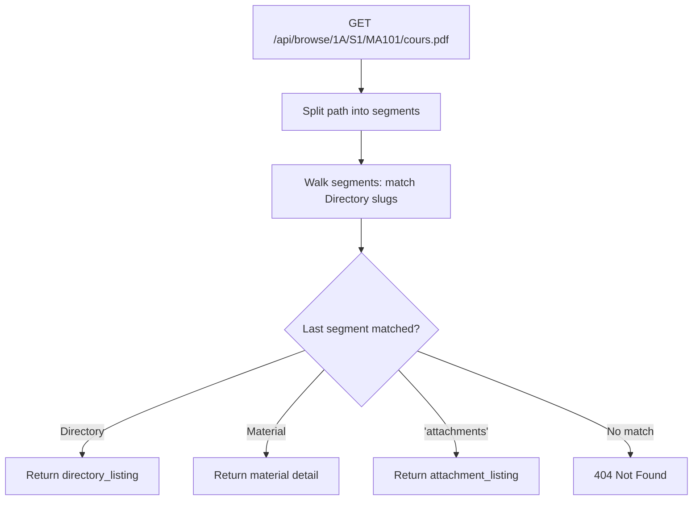

# Browse & Directories

The browse system provides hierarchical path-based navigation through the directory tree. Users access content via human-readable URL paths like `/browse/1A/S1/MA101/cours.pdf`.

**Key files**: `api/app/routers/browse.py`, `api/app/services/directory.py`, `api/app/models/directory.py`

---

## Path Resolution



The path resolution algorithm in `api/app/services/directory.py:resolve_browse_path()`:

1. **Empty path** → returns root directories
2. **Walk segments** left-to-right:
   - For each segment, first try matching a child directory by slug
   - If no directory matches, try matching a material by slug
   - Special segment `"attachments"` switches to attachment listing mode
3. **Terminal segment determines response type**:
   - Ended on a directory → `directory_listing`
   - Ended on a material → `material`
   - Found `"/attachments"` after a material → `attachment_listing`
   - An additional segment after `"/attachments"` → specific attachment material

---

## Endpoints

### GET `/api/browse`
Returns root-level directories (top of the tree).

**Response**:
```json
{
  "type": "directory_listing",
  "directory": null,
  "directories": [
    {
      "id": "uuid", "name": "1A", "slug": "1a",
      "type": "module", "child_directory_count": 2,
      "child_material_count": 0, "tags": ["year-1", "core"], ...
    }
  ],
  "materials": []
}
```

### GET `/api/browse/{path:path}`
Resolves any path to a directory listing, material, or attachment listing.

**Directory listing response**:
```json
{
  "type": "directory_listing",
  "directory": { "id": "uuid", "name": "S1", ... },
  "directories": [{"id": "uuid", "name": "MA101", "tags": ["maths"], ...}],
  "materials": [{"id": "uuid", "title": "Cours", "tags": ["analyse"], ...}],
  "breadcrumbs": [
    {"id": "uuid", "name": "1A", "slug": "1a"},
    {"id": "uuid", "name": "S1", "slug": "s1"}
  ]
}
```

**Material response**:
```json
{
  "type": "material",
  "material": {
    "id": "uuid", "title": "Cours", "slug": "cours",
    "type": "polycopie", "current_version": 2,
    "current_version_info": {
      "file_key": "materials/uuid/file.pdf",
      "file_size": 1048576, "file_mime_type": "application/pdf", ...
    }, ...
  }
}
```

**Attachment listing response**:
```json
{
  "type": "attachment_listing",
  "materials": [...],
  "parent_material": { "id": "uuid", "title": "Cours", ... }
}
```

### GET `/api/directories/{id}`
Returns a directory by UUID. **Auth**: none required.

### GET `/api/directories/{id}/children`
Returns immediate children (subdirectories + materials). Each child directory includes `child_directory_count` and `child_material_count`. Materials include their current version info.

### GET `/api/directories/{id}/path`
Returns breadcrumb trail from root to this directory.

**Response**: `[{"id": "uuid", "name": "1A", "slug": "1a"}, {"id": "uuid", "name": "S1", "slug": "s1"}]`

Implementation walks up the `parent_id` chain with cycle detection (stops if a parent has already been visited).

---

## Directory Model

Directories form a self-referential tree via `parent_id`:

- **Root directories**: `parent_id IS NULL`, represent top-level academic years (1A, 2A, 3A)
- **Intermediate**: Semesters (S1, S2), course groups
- **Leaves**: Individual course modules containing materials

Key fields:
- `slug`: URL-safe identifier, unique within parent (`UNIQUE(parent_id, slug)`)
- `type`: `module` (course-level) or `folder` (organizational)
- `is_system`: `true` for auto-created directories (e.g., attachment folders)
- `metadata_`: JSONB for extensible data (course codes, syllabus links, etc.)
- `tags`: Many-to-many relationship with the `Tag` model
- `sort_order`: Controls display ordering within parent

---

## Service Functions

| Function | File | Purpose |
|----------|------|---------|
| `get_root_directories` | `directory.py` | Fetches roots with child counts |
| `get_directory_by_id` | `directory.py` | Single directory lookup |
| `get_directory_children` | `directory.py` | Children with version info, excludes system dirs |
| `get_directory_path` | `directory.py` | Breadcrumb trail (walks parent chain) |
| `get_directory_paths` | `directory.py` | Batch path building via recursive CTE |
| `resolve_browse_path` | `directory.py` | Full path resolution algorithm |
| `slugify` | `directory.py` | Unicode normalization → lowercase → dash-separated |

The `get_directory_paths()` function uses a **recursive Common Table Expression (CTE)** to efficiently build full paths for multiple directories in a single query, used when serializing materials with their directory paths.

---

## Schemas

| Schema | File | Purpose |
|--------|------|---------|
| `DirectoryOut` | `api/app/schemas/directory.py` | Full directory fields |
| `DirectoryWithCounts` | `api/app/schemas/directory.py` | Extends DirectoryOut with child counts |
| `DirectoryBreadcrumb` | `api/app/schemas/directory.py` | Minimal {id, name, slug} for breadcrumbs |
