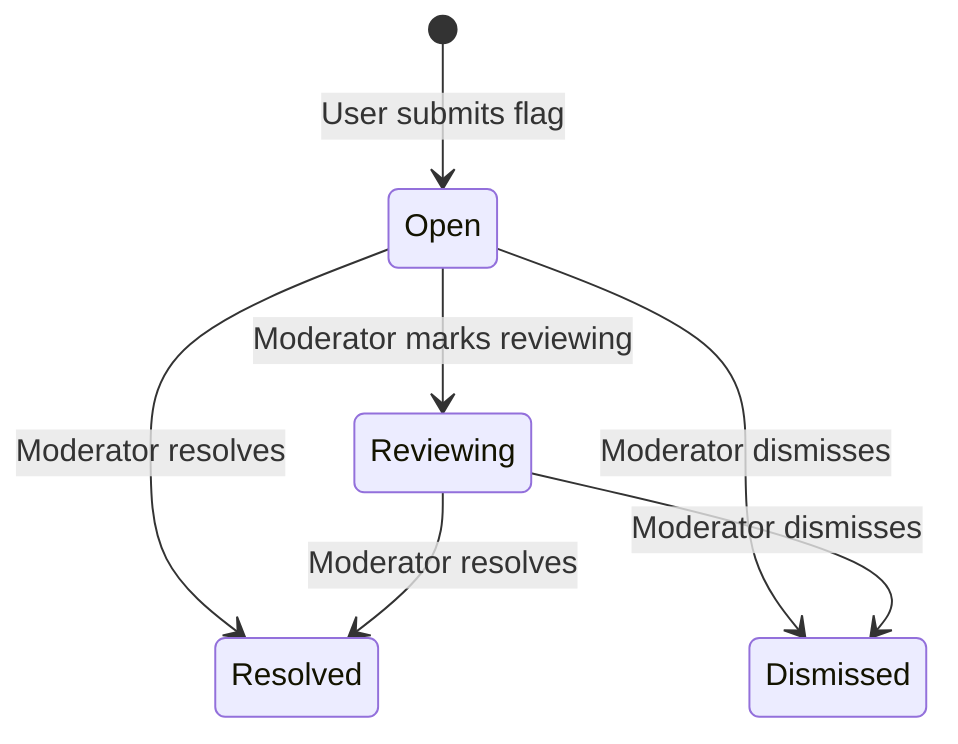

# Flags & Moderation

The flag system allows users to report inappropriate, copyrighted, or incorrect content. Moderators review and resolve flags through the admin interface.

**Key files**: `api/app/routers/flags.py`, `api/app/services/flag.py`, `api/app/models/flag.py`, `api/app/schemas/flag.py`

---

## Flag Lifecycle



---

## Flaggable Targets

Flags use a polymorphic `(target_type, target_id)` pattern. The `TARGET_TABLE_MAP` in `api/app/services/flag.py` maps types to ORM models for validation:

| target_type | Model | Example |
|-------------|-------|---------|
| `material` | Material | Copyrighted document |
| `annotation` | Annotation | Inappropriate comment on document |
| `pull_request` | PullRequest | Spam PR |
| `comment` | Comment | Off-topic comment |
| `pr_comment` | PRComment | Abusive PR review comment |

A unique constraint on `(reporter_id, target_type, target_id)` prevents a user from flagging the same item twice.

---

## Flag Reasons

| Reason | Description |
|--------|-------------|
| `inappropriate` | Offensive or inappropriate content |
| `copyright` | Copyright violation |
| `spam` | Spam or irrelevant content |
| `incorrect` | Factually incorrect or misleading |
| `other` | Other reason (requires description) |

---

## Endpoints

### POST `/api/flags`

**Auth**: OnboardedUser required.

**Request** (`FlagCreateIn`):
```json
{
  "target_type": "annotation",
  "target_id": "uuid",
  "reason": "inappropriate",
  "description": "Contains offensive language"
}
```

**Logic**:
1. Validate target entity exists (queries the appropriate model)
2. Check user hasn't already flagged this target
3. Create `Flag` record with `status=OPEN`
4. Notify all moderators via `notify_moderators()`

**Response**: `FlagOut` (201 Created)

### GET `/api/flags`

**Auth**: Moderator role required (MEMBER/BUREAU/VIEUX).

**Query params**: `status` (optional), `targetType` (optional), `page`, `limit`

**Response**: `PaginatedResponse[FlagOut]`

### PATCH `/api/flags/{flag_id}`

**Auth**: Moderator role required.

**Request** (`FlagUpdateIn`): `{"status": "resolved"}` or `{"status": "dismissed"}`

**Logic**:
1. Validate user has moderator role
2. Update `status`, set `resolved_by` to current user, set `resolved_at` to now
3. Notify the original reporter of the resolution

---

## Moderator Powers

Beyond flags, moderators (MEMBER/BUREAU/VIEUX) have additional powers across the system:

| Action | Endpoint | Notes |
|--------|----------|-------|
| Delete any annotation | `DELETE /api/annotations/{id}` | Author or moderator |
| Delete any comment | `DELETE /api/comments/{id}` | Author or moderator |
| Delete any PR comment | `DELETE /api/pr-comments/{id}` | Author or moderator |
| Approve PRs | `POST /api/pull-requests/{id}/approve` | Moderator only |
| Reject PRs | `POST /api/pull-requests/{id}/reject` | Moderator only |
| View all flags | `GET /api/flags` | Moderator only |
| Resolve flags | `PATCH /api/flags/{id}` | Moderator only |
| View admin stats | `GET /api/admin/stats` | Moderator only |
| List all users | `GET /api/admin/users` | Moderator only |
| Change user roles | `PATCH /api/admin/users/{id}/role` | BUREAU/VIEUX only |
| Delete users | `DELETE /api/admin/users/{id}` | BUREAU/VIEUX only |
