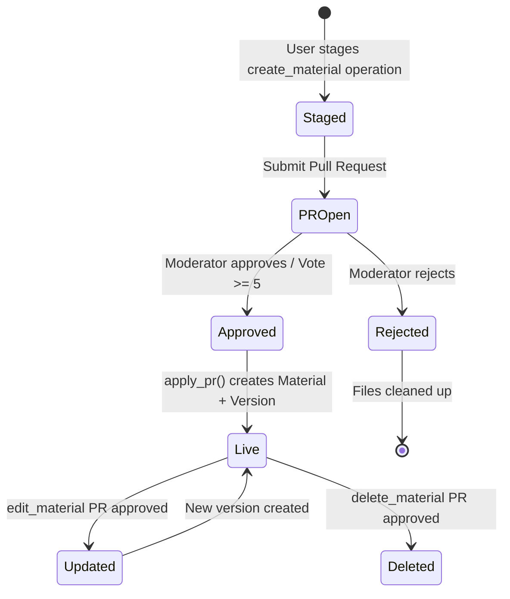

# Materials

Materials are the core content unit — course documents, videos, cheat sheets, and other educational resources. Each material lives in a directory, has a version history, and can have child attachments.

**Key files**: `api/app/routers/materials.py`, `api/app/services/material.py`, `api/app/models/material.py`, `api/app/schemas/material.py`

---

## Material Lifecycle



Materials are never created directly — they always go through the pull request workflow. When a PR is approved, `apply_pr()` creates the Material record, moves files from `uploads/` to `materials/` in MinIO, and creates the initial `MaterialVersion`.

---

## Endpoints

### GET `/api/materials/{material_id}`
Returns full material detail with current version info.

**Response** (`MaterialDetail`):
```json
{
  "id": "uuid",
  "directory_id": "uuid",
  "directory_path": "1a/s1/ma101",
  "title": "Cours d'analyse",
  "slug": "cours-d-analyse",
  "description": "...",
  "type": "polycopie",
  "current_version": 2,
  "parent_material_id": null,
  "author_id": "uuid",
  "metadata": {},
  "download_count": 42,
  "attachment_count": 3,
  "created_at": "2026-03-10T...",
  "updated_at": "2026-03-12T...",
  "current_version_info": {
    "id": "uuid",
    "material_id": "uuid",
    "version_number": 2,
    "file_key": "materials/uuid/cours.pdf",
    "file_name": "cours.pdf",
    "file_size": 2097152,
    "file_mime_type": "application/pdf",
    "diff_summary": "Updated chapter 3",
    "author_id": "uuid",
    "pr_id": "uuid",
    "created_at": "2026-03-12T..."
  }
}
```

### GET `/api/materials/{material_id}/download`
Increments `download_count`, generates a presigned S3 GET URL, and returns a **302 redirect** to it. The presigned URL has a 15-minute TTL.

### GET `/api/materials/{material_id}/inline`
Same as download but without incrementing the counter. Used for in-browser preview (PDF viewer, etc.).

### GET `/api/materials/{material_id}/file`
Streams the file content directly through the API. Returns the raw bytes with the correct `Content-Type` and `Content-Disposition: inline`. Used when presigned URLs aren't suitable.

### GET `/api/materials/{material_id}/versions`
Lists all versions, newest first.

### GET `/api/materials/{material_id}/versions/{version_number}`
Returns a specific version.

### GET `/api/materials/{material_id}/versions/{version_number}/download`
Download a specific historical version via presigned redirect.

### GET `/api/materials/{material_id}/attachments`
Lists child materials (`parent_material_id = material_id`), ordered by title. Attachments are supplementary files (solutions, errata, etc.) linked to a main material.

### POST `/api/materials/{material_id}/view`
**Auth**: Required (CurrentUser)

Records a view event. Uses upsert logic — if the user has already viewed this material, updates `viewed_at`; otherwise creates a new `ViewHistory` record. The unique constraint on `(user_id, material_id)` enforces one record per pair.

**Response**: `{"status": "ok"}`

---

## Material Types

The `type` field categorizes content. Allowed values (validated in PR schemas):

| Type | Description |
|------|-------------|
| `polycopie` | Course handout / lecture notes |
| `annal` | Past exam paper |
| `cheatsheet` | Summary / cheat sheet |
| `tip` | Study tip or trick |
| `review` | Course review or feedback |
| `discussion` | Discussion document |
| `video` | Video content (may use `metadata.video_url`) |
| `document` | Generic document |
| `other` | Anything else |

---

## Version System

Each time a material's file is updated (via an `edit_material` PR operation with a new `file_key`), a new `MaterialVersion` is created:

1. PR approval triggers `_exec_edit_material` in `api/app/services/pr.py`
2. `Material.current_version` is incremented
3. New `MaterialVersion` record created with the new `version_number`, `file_key`, `file_size`, `file_mime_type`, `author_id`, and `pr_id`
4. Old versions remain accessible via `/versions/{number}/download`

The `diff_summary` field on versions stores a human-readable description of what changed.

---

## Attachment System

Materials can have child materials (attachments) via `parent_material_id`. When a `create_material` operation includes an `attachments` array:

1. A system directory is created for the attachment files (with `is_system=True`)
2. Each attachment becomes a separate `Material` record with `parent_material_id` pointing to the main material
3. Attachments cannot themselves have attachments (no nesting)

The browse endpoint recognizes the `/attachments` path segment to list a material's attachments.

---

## Service Layer

Key functions in `api/app/services/material.py`:

| Function | Purpose |
|----------|---------|
| `material_orm_to_dict(m)` | Converts ORM object to dict safe for Pydantic, extracts directory_path |
| `get_material_by_id(db, id)` | Simple lookup, raises NotFoundError |
| `get_material_with_version(db, id)` | Material + current version + attachment count |
| `get_material_versions(db, id)` | All versions, newest first |
| `get_material_version(db, id, num)` | Specific version by number |
| `get_material_attachments(db, id)` | Child materials ordered by title |
| `increment_download_count(db, id)` | Atomically increment counter |
| `record_view(db, user_id, material_id)` | Upsert into ViewHistory |
