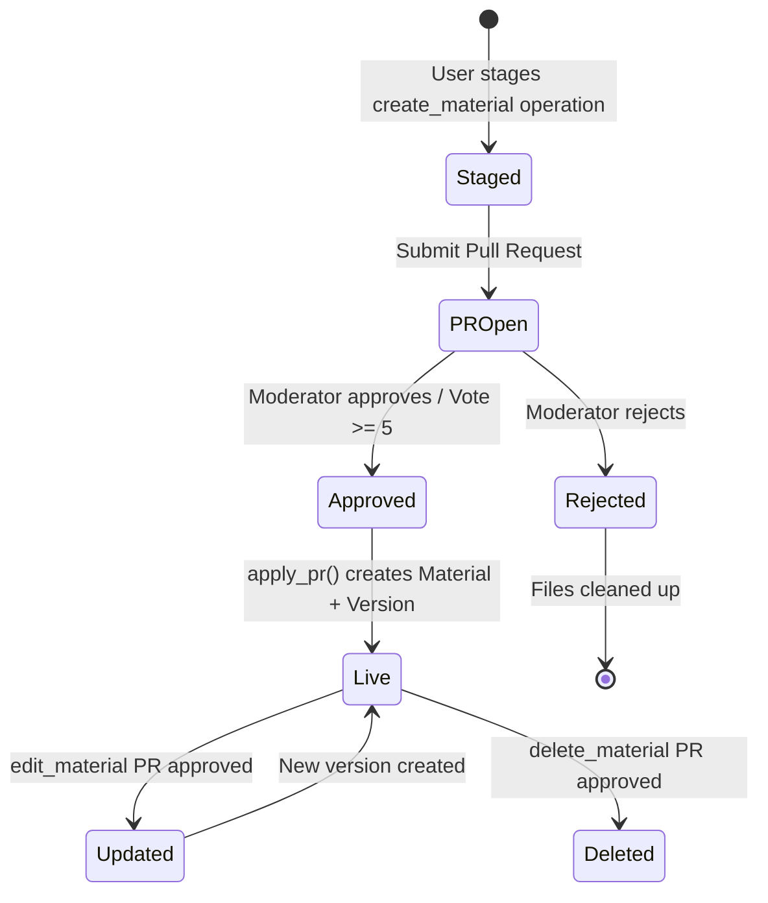

# Materials

Materials are the core content unit — course documents, videos, cheat sheets, and other educational resources. Each material lives in a directory, has a version history, and can have child attachments.

**Key files**: `api/app/routers/materials.py`, `api/app/services/material.py`, `api/app/models/material.py`, `api/app/schemas/material.py`

---

## Material Lifecycle



Materials are never created directly — they always go through the pull request workflow. When a PR is approved, `apply_pr()` creates the Material record, moves files from `uploads/` to `materials/` in MinIO, and creates the initial `MaterialVersion`.

---

## Endpoints

All material endpoints require **authentication** (`CurrentUser`). Unauthenticated requests will return a `401 Unauthorized` response.

### GET `/api/materials/{material_id}`
Returns full material detail with current version info.

**Auth**: Required (CurrentUser)

**Response** (`MaterialDetail`):
```json
{
  "id": "uuid",
  "directory_id": "uuid",
  "title": "Cours d'Analyse",
  "slug": "cours-analyse",
  "type": "polycopie",
  "current_version": 1,
  "download_count": 42,
  "attachment_count": 2,
  "tags": ["maths", "analyse", "s1"],
  "created_at": "2024-03-24T12:00:00Z",
  "updated_at": "2024-03-24T12:00:00Z",
  "current_version_info": { ... }
}
```

### GET `/api/materials/{material_id}/download-url`
**Auth**: Required (CurrentUser)

Increments `download_count`, records a download audit entry, generates a presigned S3 GET URL (15-minute TTL), and returns it as a JSON object: `{"url": "..."}`. The frontend opens the URL in a new tab via `useDownload` hook. Subject to rate limiting — see [Download Rate Limiting & Auditing](#download-rate-limiting--auditing).

### GET `/api/materials/{material_id}/inline`
**Auth**: Required (CurrentUser)

Returns a JSON object `{"url": "..."}` with a presigned S3 GET URL (15-minute TTL) without incrementing the download counter. Used by frontend viewers (PDF, code, image, etc.) to fetch file content via a two-step flow: first get the presigned URL from `/inline`, then fetch the file directly from S3 without auth headers. This avoids the S3 400 error caused by forwarding `Authorization` headers on same-origin redirects.

### GET `/api/materials/{material_id}/file`
**Auth**: Required (CurrentUser or query `?token=`)

Redirects (302) to a presigned S3 GET URL. Used by native HTML elements (`<video>`, `<audio>`) that need direct URL access with Range request support. Not suitable for `fetch()` calls — use `/inline` instead to avoid auth header conflicts with presigned URLs.

### GET `/api/materials/{material_id}/versions`
**Auth**: Required (CurrentUser)

Lists all versions, newest first.

### GET `/api/materials/{material_id}/versions/{version_number}`
**Auth**: Required (CurrentUser)

Returns a specific version.

### GET `/api/materials/{material_id}/versions/{version_number}/download-url`
**Auth**: Required (CurrentUser)

Same as the top-level download-url but for a specific historical version. Returns `{"url": "..."}` with a presigned GET URL for that version's file.

### GET `/api/materials/{material_id}/attachments`
**Auth**: Required (CurrentUser)

Lists child materials (`parent_material_id = material_id`), ordered by title. Attachments are supplementary files (solutions, errata, etc.) linked to a main material.

### POST `/api/materials/{material_id}/view`
**Auth**: Required (CurrentUser)

Records a view event. Uses upsert logic — if the user has already viewed this material, updates `viewed_at`; otherwise creates a new `ViewHistory` record. The unique constraint on `(user_id, material_id)` enforces one record per pair.

**Response**: `{"status": "ok"}`

---

## Security & Storage

All files are stored in a **private** MinIO bucket (`local/wikint` by default). The bucket policy is set to `none`, meaning direct unauthenticated access to S3/MinIO URLs is prohibited. 

Access is only possible through:
1.  The API's authenticated endpoints (`/download-url`, `/inline`, `/file`).
2.  Presigned URLs generated by the API with a short TTL (15 minutes). Presigned URLs are signed using **SigV4** (`X-Amz-Algorithm=AWS4-HMAC-SHA256`) and proxied through nginx at `/s3/`, which passes `Host: minio:9000` to match the signing endpoint. Expired presigned URLs return a styled error page instead of a raw XML 403.

These URLs must be requested with a valid **Authorization: Bearer <token>** header. In the frontend, the `AudioPlayer`, `VideoPlayer`, and `ImageViewer` components use `getAccessToken()` to provide this header for file streams.

### Download Rate Limiting & Auditing

To prevent automated scraping and ensure fair usage, **actual file downloads** (via `/download-url`) are subject to strict rate limits:

- **Minute Limit**: 10 downloads per minute per user. (Blocks download, no flagging)
- **Daily Limit**: 200 downloads per day per user. (Blocks download and **flags account**)

**Note**: In-browser streaming and previews (via `/file`) are **exempt** from these rate limits to ensure a smooth browsing experience when navigating through media files.

If a user exceeds the download limits:
1.  The request returns a `429 Too Many Requests` error with a clear message.
2.  If the **daily limit** is reached, the user's account is **automatically flagged** (`is_flagged=True`).
3.  Flagging acts as a notification for administrators to review the account activity. It **does not** automatically block the user from the application.

All file access (downloads and streams) is recorded in the `download_audit` table and emitted as structured JSON logs for security monitoring.

### File Integrity & Malware Protection

To ensure the safety and correctness of course materials, several automated checks are performed:

1.  **MIME/Extension Auto-Correction**: During upload completion, the API reads the file's magic bytes and detects the real MIME type. If the detected type doesn't match the file extension, the file is automatically renamed with the correct extension (e.g., a `.ogg` file detected as MP3 becomes `.mp3`). The corrected `file_key` is returned to the frontend.
2.  **Mandatory Malware Scanning**: Every uploaded file is scanned synchronously by ClamAV before `upload/complete` returns.
    *   Results are stored in the `virus_scan_result` column of `PullRequest` and `MaterialVersion`.
    *   **Hard Blocking**: A Pull Request **cannot be approved** (manually or automatically) until the scan result is `CLEAN` or `SKIPPED`.
    *   **Automatic Rejection**: If a file is found to be `INFECTED`, the file is deleted from storage and the upload rejected with 400.
3.  **Metadata Stripping**: To protect user privacy (PII), files under 50 MB are automatically sanitized during upload completion:
    *   **Images**: EXIF data (GPS, camera info) is removed via Pillow.
    *   **PDFs**: Document Information dictionaries and XMP metadata are stripped via pikepdf.
    *   **Video** (MP4, WebM, OGG): All metadata is stripped via ffmpeg (stream copy, no re-encoding).
    *   **Audio** (MP3, FLAC, OGG, WAV, M4A): ID3 tags, Vorbis comments, and MP4 atoms are stripped via mutagen.

---

## Material Types

The `type` field categorizes content. Allowed values (validated in PR schemas):

| Type | Description |
|------|-------------|
| `polycopie` | Course handout / lecture notes |
| `annal` | Past exam paper |
| `cheatsheet` | Summary / cheat sheet |
| `tip` | Study tip or trick |
| `review` | Course review or feedback |
| `discussion` | Discussion document |
| `video` | Video content (may use `metadata.video_url`) |
| `document` | Generic document |
| `other` | Anything else |

---

## Version System

Each time a material's file is updated (via an `edit_material` PR operation with a new `file_key`), a new `MaterialVersion` is created:

1. PR approval triggers `_exec_edit_material` in `api/app/services/pr.py`
2. `Material.current_version` is incremented
3. New `MaterialVersion` record created with the new `version_number`, `file_key`, `file_size`, `file_mime_type`, `author_id`, and `pr_id`
4. Old versions remain accessible via `/versions/{number}/download-url`

The `diff_summary` field on versions stores a human-readable description of what changed.

---

## Attachment System

Materials can have child materials (attachments) via `parent_material_id`. When a `create_material` operation includes an `attachments` array:

1. A system directory is created for the attachment files (with `is_system=True`)
2. Each attachment becomes a separate `Material` record with `parent_material_id` pointing to the main material
3. Attachments cannot themselves have attachments (no nesting)

The browse endpoint recognizes the `/attachments` path segment to list a material's attachments.

---

## Service Layer

Key functions in `api/app/services/material.py`:

| Function | Purpose |
|----------|---------|
| `material_orm_to_dict(m)` | Converts ORM object to dict safe for Pydantic, extracts directory_path and serializes tags |
| `get_material_by_id(db, id)` | Simple lookup, raises NotFoundError |
| `get_material_with_version(db, id)` | Material + current version + attachment count |
| `get_material_versions(db, id)` | All versions, newest first |
| `get_material_version(db, id, num)` | Specific version by number |
| `get_material_attachments(db, id)` | Child materials ordered by title |
| `increment_download_count(db, id)` | Atomically increment counter |
| `record_view(db, user_id, material_id)` | Upsert into ViewHistory |
