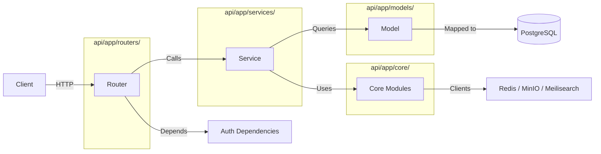

# API Overview

The WikINT backend is a FastAPI application serving a REST API at `/api/*`. It follows a three-layer architecture: Routers handle HTTP, Services contain business logic, and Models define the database schema.

---

## Application Bootstrap

The application is assembled in `api/app/main.py`:

### Lifespan
An async context manager initializes external services on startup and cleans up on shutdown:
- **Startup**: Creates Meilisearch indexes (`api/app/core/meilisearch.py`), initializes the ARQ Redis pool (`api/app/core/redis.py`)
- **Shutdown**: Closes the ARQ pool

### Middleware Stack
Applied to every request in order:
1. **CORS** — Allows requests from `settings.frontend_url`
2. **Rate Limiting** — slowapi with Redis storage, 60 requests/minute globally (disabled when `settings.is_dev`)
3. **Request Logging** — Custom middleware that logs `METHOD /path → STATUS in Xms`

### Health Check
```
GET /api/health → {"status": "ok"}
```

### SQLAdmin (Dev Only)
When `settings.is_dev`, a SQLAdmin interface is mounted with ModelView wrappers for: User, Directory, Material, MaterialVersion, Tag, Annotation, Comment, PullRequest, Notification.

---

## Three-Layer Architecture



| Layer | Location | Responsibility |
|-------|----------|----------------|
| **Routers** | `api/app/routers/*.py` | HTTP endpoint definitions, request parsing, response serialization |
| **Services** | `api/app/services/*.py` | Business logic, database queries, authorization checks |
| **Models** | `api/app/models/*.py` | SQLAlchemy ORM definitions |
| **Schemas** | `api/app/schemas/*.py` | Pydantic models for request/response validation |
| **Core** | `api/app/core/*.py` | Infrastructure clients (database, Redis, MinIO, Meilisearch, email, security) |
| **Dependencies** | `api/app/dependencies/*.py` | FastAPI dependency injection (auth, pagination) |
| **Workers** | `api/app/workers/*.py` | Background tasks (ARQ) |

---

## Dependency Injection

### Database Session — `get_db()`
Defined in `api/app/core/database.py`. Yields an `AsyncSession` scoped to the request. On success, commits the transaction and enqueues any post-commit jobs to ARQ. On exception, rolls back.

```python
async def get_db() -> AsyncGenerator[AsyncSession, None]:
    async with async_session_factory() as session:
        try:
            yield session
            await session.commit()
            # Enqueue post-commit jobs to ARQ
            for job in session.info.get("post_commit_jobs", []):
                await arq_pool.enqueue_job(job["func"], *job["args"])
        except Exception:
            await session.rollback()
            raise
```

### Redis Client — `get_redis()`
Defined in `api/app/core/redis.py`. Returns the module-level `redis_client` instance.

### Auth Dependencies — `api/app/dependencies/auth.py`

| Dependency | Purpose |
|------------|---------|
| `get_current_user` | Extracts Bearer token → decodes JWT → checks Redis blacklist → fetches User from DB |
| `CurrentUser` | Annotated alias for `Depends(get_current_user)` |
| `OnboardedUser` | Like CurrentUser but also requires `user.onboarded == True` |
| `require_role(*roles)` | Factory returning a dependency that checks `user.role in roles` |
| `require_moderator()` | Shortcut for `require_role(MEMBER, BUREAU, VIEUX)` |
| `require_onboarded()` | Factory requiring `user.onboarded` |

### Pagination — `api/app/dependencies/pagination.py`

```python
class PaginationParams:
    page: int  # 1-indexed, minimum 1
    limit: int  # 1-100
    offset: int  # computed as (page - 1) * limit
```

---

## Error Handling

Custom exceptions in `api/app/core/exceptions.py` extend `HTTPException`:

| Exception | Status | Default Message |
|-----------|--------|----------------|
| `NotFoundError` | 404 | "Not found" |
| `BadRequestError` | 400 | "Bad request" |
| `UnauthorizedError` | 401 | "Unauthorized" |
| `ForbiddenError` | 403 | "Forbidden" |
| `ConflictError` | 409 | "Conflict" |
| `RateLimitError` | 429 | "Rate limit exceeded" |
| `ServiceUnavailableError` | 503 | "Service unavailable" |

All exceptions accept a custom `detail` string. FastAPI serializes them as `{"detail": "message"}`.

---

## Pagination Response

All list endpoints use a standard envelope defined in `api/app/schemas/common.py`:

```python
class PaginatedResponse(BaseModel, Generic[T]):
    items: list[T]
    total: int    # Total matching items
    page: int     # Current page (1-indexed)
    pages: int    # Total pages
```

---

## Post-Commit Job Pattern

Services register background jobs during request processing:

```python
# In a service function:
session.info.setdefault("post_commit_jobs", []).append({
    "func": "index_material",
    "args": [material_id]
})
```

After `get_db()` commits the transaction, it iterates `post_commit_jobs` and enqueues each to the ARQ Redis pool. This ensures jobs only execute when the underlying data has been committed. See `api/app/core/database.py`.

---

## Router Registration

All 13 routers are included in `api/app/main.py`:

| Router | Prefix | Source File |
|--------|--------|-------------|
| Auth | `/api/auth` | `api/app/routers/auth.py` |
| Users | `/api/users` | `api/app/routers/users.py` |
| Materials | `/api/materials` | `api/app/routers/materials.py` |
| Directories | (within browse) | `api/app/routers/directories.py` |
| Browse | `/api` | `api/app/routers/browse.py` |
| Search | `/api/search` | `api/app/routers/search.py` |
| Upload | `/api/upload` | `api/app/routers/upload.py` |
| Pull Requests | `/api/pull-requests` | `api/app/routers/pull_requests.py` |
| PR Comments | `/api/pr-comments` | `api/app/routers/pr_comments.py` |
| Annotations | `/api/annotations` + `/api/materials` | `api/app/routers/annotations.py` |
| Comments | `/api/comments` | `api/app/routers/comments.py` |
| Flags | `/api/flags` | `api/app/routers/flags.py` |
| Notifications | `/api/notifications` | `api/app/routers/notifications.py` |
| Admin | `/api/admin` | `api/app/routers/admin.py` |
