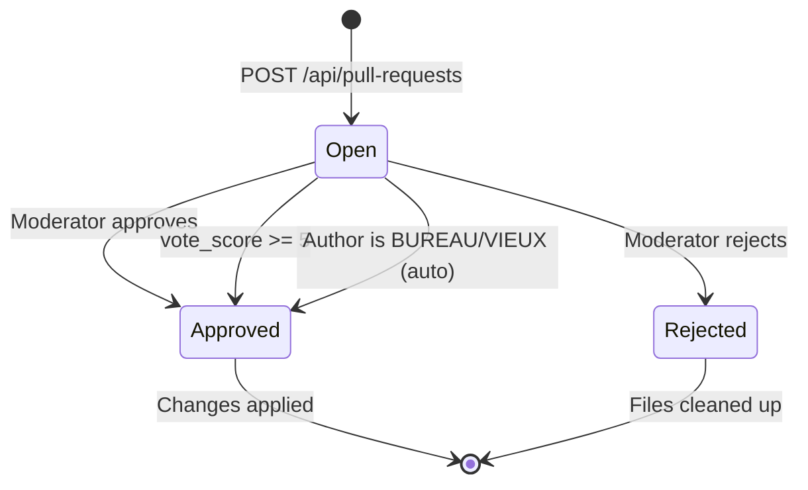
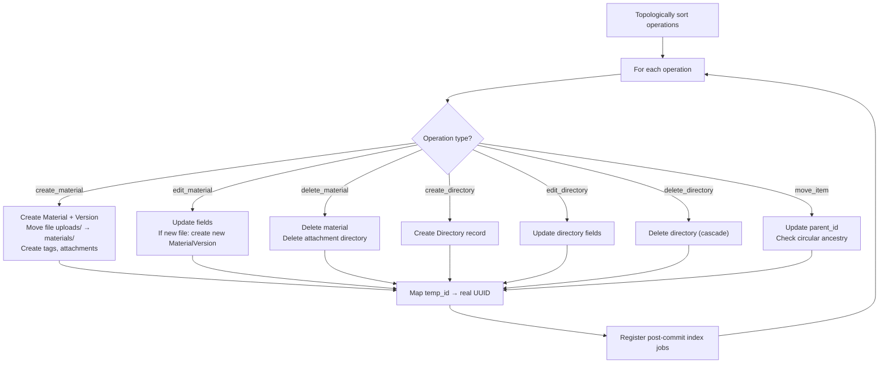

# Pull Requests

The pull request system is WikINT's central content management mechanism. Inspired by GitHub PRs, it allows users to propose batch changes to materials and directories. Changes require community voting or moderator approval before taking effect.

**Key files**: `api/app/routers/pull_requests.py`, `api/app/services/pr.py`, `api/app/schemas/pull_request.py`, `api/app/models/pull_request.py`

---

## Lifecycle



---

## Operation Types

A PR contains an array of operations in its `payload` JSONB column. Operations are a discriminated union on the `op` field, defined in `api/app/schemas/pull_request.py`:

| Operation | Key Fields | Description |
|-----------|-----------|-------------|
| `create_material` | directory_id, title, type, tags?, file_key?, attachments? | Create a new material with optional file, attachments, and tags |
| `edit_material` | material_id, title?, type?, tags?, file_key?, diff_summary? | Update material fields, tags, or replace the file |
| `delete_material` | material_id | Remove material and its attachment directory |
| `create_directory` | parent_id?, name, type? | Create a new folder or module |
| `edit_directory` | directory_id, name?, description?, tags? | Update directory fields |
| `delete_directory` | directory_id | Remove directory and cascade contents |
| `move_item` | target_type, target_id, new_parent_id | Move material or directory to new parent |

### Validation Rules
- Maximum **50 operations** per PR
- Maximum **5 open PRs** per student (unlimited for BUREAU/VIEUX)
- `file_key` must start with `uploads/{user_id}/` (ownership check)
- **Scan verification**: All `file_key`s must have a Redis scan cache entry (`upload:scanned:{file_key}`), proving they passed virus scanning via `complete_upload`. Files that haven't been scanned are rejected at PR creation.
- **File key claiming**: Each `file_key` can only be referenced by one open PR at a time. Attempting to reuse a `file_key` that is already attached to another open PR returns an error.
- **Attachment validation**: Attachments are validated with a typed `AttachmentOp` model that enforces the same validators as `CreateMaterialOp` (title, type, file_key, file_name, tags, metadata).
- Attachments cannot be nested (no attachments on attachments)
- Tags: max **20 per item**, max **20 chars each** (enforced in `PullRequestCreate` schema)
- Metadata: max 20 keys
- `temp_id` values must be unique across all operations

---

## Temp ID System

Operations can reference each other via temporary IDs prefixed with `$`. This enables creating a directory and immediately placing materials in it within the same PR:

```json
{
  "operations": [
    {"op": "create_directory", "temp_id": "$dir-1", "name": "New Module"},
    {"op": "create_material", "directory_id": "$dir-1", "title": "Cours", "type": "polycopie"}
  ]
}
```

During execution, `$dir-1` is resolved to the actual UUID of the created directory.

### Topological Sort

Operations are sorted using **Kahn's algorithm** (`api/app/services/pr.py:topo_sort_operations`) to ensure dependencies are executed first. If `create_material` references `$dir-1`, the `create_directory` with `temp_id: "$dir-1"` executes first.

Cyclic dependencies are detected and rejected with a `BadRequestError`.

---

## Virus Scanning

Virus scanning happens **synchronously** during `POST /api/upload/complete`. By the time a `file_key` is returned to the client, the file has already been:
1. Checked for MIME/extension consistency
2. Stripped of metadata (EXIF, PDF Info) if <50MB
3. Scanned by ClamAV via the INSTREAM protocol

If the scan fails or ClamAV is unavailable, the upload is rejected (fail-closed with 503). Infected files are deleted and rejected with 400.

Every PR carries a `virus_scan_result` field (VARCHAR(20)). Since all files are pre-scanned, PRs are created with `virus_scan_result = clean` (if files present) or `skipped` (no files). The `pending`, `error`, and `infected` states are no longer set at PR creation.

### Auto-approve for BUREAU / VIEUX

On PR creation, if the author is `BUREAU` or `VIEUX`, the PR is immediately approved and `apply_pr()` is called. No scan checks are needed since files are already clean.

---

## Execution Pipeline

When a PR is approved, `apply_pr()` in `api/app/services/pr.py` runs:



### MIME Type Resolution
When creating/editing materials with files, the system determines MIME type in priority order:
1. Detect from actual file bytes (magic byte analysis via `read_object_bytes`)
2. Guess from filename extension
3. Fall back to client-provided hint

### Slug Generation
Material and directory slugs are generated using Unicode-aware `slugify` (NFKD normalization → ASCII → lowercase → dash-separated). Collisions within the same directory are resolved automatically by appending `-2`, `-3`, etc.

### Circular Ancestry Detection
`move_item` for directories walks up the parent chain from `new_parent_id` to verify the target directory isn't an ancestor of the item being moved. This prevents creating infinite loops in the directory tree.

---

## Endpoints

### POST `/api/pull-requests`
**Auth**: Required. **Request** (`PullRequestCreate`):
```json
{
  "title": "Add MA101 course materials",
  "description": "Adding lecture notes and past exams",
  "operations": [...]
}
```

Validates that all referenced `file_key`s exist in storage and have passed virus scanning (Redis scan cache check). Rejects any `file_key` already claimed by another open PR. For BUREAU/VIEUX authors, the PR is auto-approved and applied immediately (files are already scanned clean at upload time).

**Response**: `PullRequestOut` (201 Created)

### GET `/api/pull-requests`
**Auth**: Required. **Query params**: `status`, `type`, `author_id`, `page`, `limit` (max 100).

Returns list with `vote_score` and `user_vote` computed for the current user.

### GET `/api/pull-requests/for-item`
**Auth**: Required. **Query params**: `targetType` (material/directory), `targetId`.

Searches the `payload` JSONB array for operations referencing the specified item. Uses raw SQL with JSONB array search operators.

### GET `/api/pull-requests/{id}`
**Auth**: Required. Returns full PR detail with `vote_score` and `user_vote`.

### POST `/api/pull-requests/{id}/vote`
**Auth**: Required. **Query param**: `value` (-1, 0, or 1). Value 0 removes the vote.

**Rules**:
- Cannot vote on your own PR
- Cannot vote on closed PRs (approved/rejected)
- If `vote_score >= 5` after voting: auto-approve and apply the PR

**Response**: `{"status": "ok", "vote_score": 7}`

### POST `/api/pull-requests/{id}/approve`
**Auth**: MEMBER, BUREAU, or VIEUX role required.

Sets `status=APPROVED`, `reviewed_by=current_user`, calls `apply_pr()`, notifies the author.

### POST `/api/pull-requests/{id}/reject`
**Auth**: MEMBER, BUREAU, or VIEUX role required.

Sets `status=REJECTED`, `reviewed_by=current_user`, deletes all `file_key` objects from S3 (uploads/), notifies the author.

### GET `/api/pull-requests/{id}/diff`
Returns count of operations with files.

### GET `/api/pull-requests/{id}/preview?opIndex=0`
Returns a presigned URL for previewing a specific operation's file. If the PR is approved and the file has been moved from `uploads/` to `materials/`, the path is rewritten automatically.

### GET `/api/pull-requests/{id}/comments`
Lists PR comments. **Auth**: Required.

### POST `/api/pull-requests/{id}/comments`
Creates a PR comment. Supports threading via `parent_id`. Notifies the parent comment's author if it's a reply to someone else.

**Request**: `{"body": "Looks good!", "parent_id": null}`

**Validation**: `body` must be between 1 and 10,000 characters.

---

## Voting Model

`PRVote` in `api/app/models/pull_request.py`:
- Unique constraint: `(pr_id, user_id)` — one vote per user per PR
- `value`: SMALLINT constrained to -1 or 1
- Score computed as `SUM(votes.value)` across all votes for a PR
- The SQL view `pull_requests_with_score` pre-computes vote_score, upvotes, downvotes

---

## PR Comments

`PRComment` supports threaded discussions:
- `parent_id` FK to self for reply chains
- CRUD via `/api/pull-requests/{id}/comments` (list/create) and `/api/pr-comments/{id}` (edit/delete)
- Edit: author only
- Delete: author or moderator
