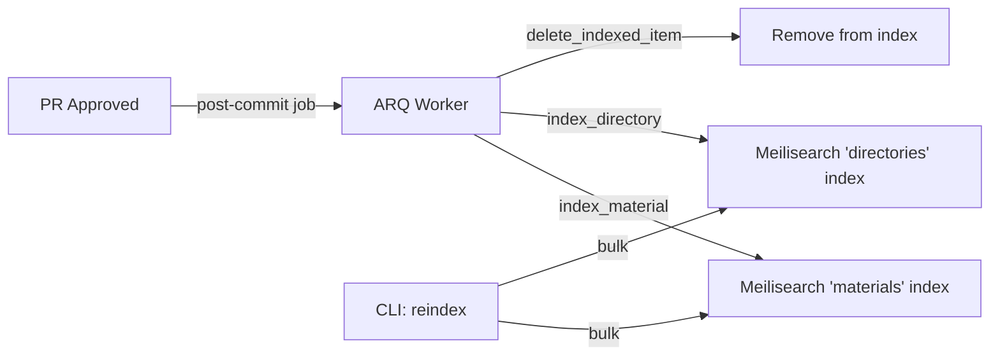

# Search

WikINT provides full-text search across materials and directories via Meilisearch. Search supports typo tolerance, identifier splitting (e.g., "MA101" matches "MA 101"), and combined results from multiple indexes.

**Key files**: `api/app/routers/search.py`, `api/app/services/search.py`, `api/app/core/meilisearch.py`, `api/app/workers/index_content.py`, `api/app/cli.py`

---

## Indexing Pipeline



### Index Configuration (`api/app/core/meilisearch.py`)

**Materials index**:
- Searchable: `title`, `description`, `tags`, `slug`, `type`, `author`, `ancestor_path`, `browse_path`, `extra_searchable`
- Filterable: `type`, `directory_id`

**Directories index**:
- Searchable: `name`, `description`, `slug`, `type`, `tags`, `code`, `ancestor_path`, `browse_path`, `extra_searchable`
- Filterable: `parent_id`, `type`

**Typo tolerance**: 1 typo for words >= 5 chars, 2 typos for words >= 9 chars.

### Document Structure

When indexing a material (`api/app/workers/index_content.py:index_material`):

```json
{
  "id": "uuid",
  "title": "Cours d'analyse",
  "slug": "cours-d-analyse",
  "description": "Introduction to real analysis",
  "type": "polycopie",
  "tags": ["analysis", "math"],
  "authorName": "Alice Dupont",
  "directory_id": "uuid",
  "created_at": "2026-03-10T...",
  "ancestor_path": "1A > S1 > MA101",
  "browse_path": "/browse/1a/s1/ma101/cours-d-analyse",
  "extra_searchable": "Cours d analyse MA 101"
}
```

The `extra_searchable` field is generated by `split_identifiers()` — it inserts spaces between letter/digit boundaries (e.g., "CS102ABC" becomes "CS 102 ABC") so that partial searches work better.

### Reindexing

The CLI command `reindex` (`api/app/cli.py`) rebuilds all indexes from scratch by querying every material and directory from PostgreSQL and upserting into Meilisearch.

---

## Search Endpoint

### GET `/api/search`

**Query params**: `q` (required, min 1 char), `page` (default 1), `limit` (default 10, max 50)

**Logic** (`api/app/services/search.py:perform_search`):
1. Calculates offset from page/limit
2. Performs multi-search across both "materials" and "directories" indexes
3. Tags each result with `search_type` ("material" or "directory")
4. Sorts: directories first, then materials
5. Applies limit

**Response**:
```json
{
  "items": [
    {"search_type": "directory", "id": "uuid", "name": "MA101", "type": "module", ...},
    {"search_type": "material", "id": "uuid", "title": "Cours d'analyse", "type": "polycopie", ...}
  ],
  "total": 15,
  "page": 1,
  "limit": 10
}
```
