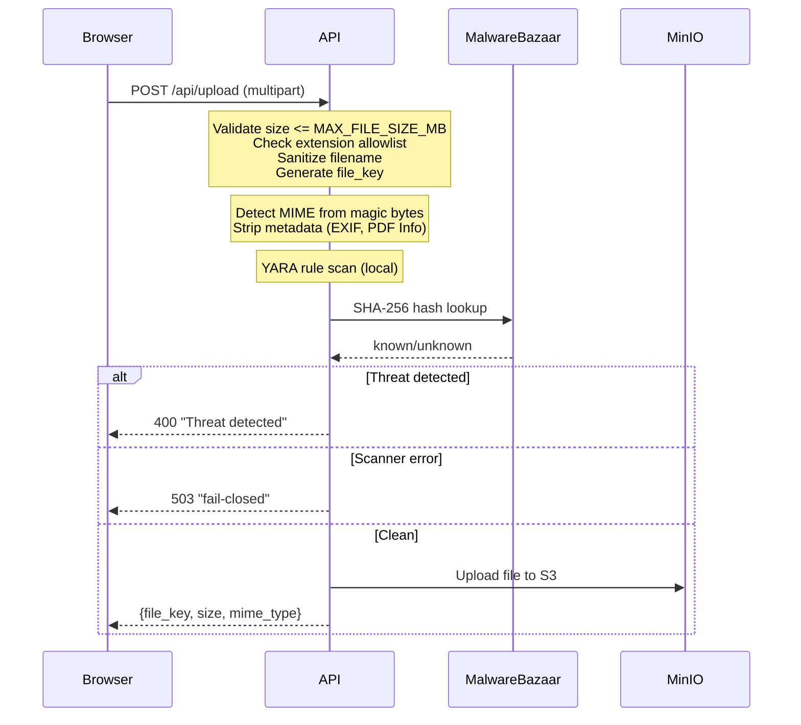

# File Upload

File uploads use a single multipart POST to `/api/upload`. File bytes flow through the API server, where they are scanned for malware (YARA rules + MalwareBazaar hash lookup), checked for MIME correctness, and stripped of metadata — all synchronously — before being stored in S3.

**Key files**: `api/app/routers/upload.py`, `api/app/core/scanner.py`, `api/app/core/minio.py`, `api/app/schemas/material.py`

---

## Upload Flow

---

## Endpoints

### POST `/api/upload`

**Auth**: Required (CurrentUser).

**Request**: Multipart form data with the file as the `file` field.

**Validation**:
- File size must be <= `MAX_FILE_SIZE_MB` (default 100 MiB, configurable via `.env`)
- `filename` sanitized: path components stripped, control characters removed (U+0000–U+001F, U+007F), Unicode bidirectional overrides and zero-width characters stripped, spaces and URL-unsafe characters replaced with underscores
- **Extension allowlist**: Only viewer-supported file types are accepted (documents, images, audio, video, Office, code/text). Note: `.xml` is explicitly excluded to prevent SVG smuggling/XSS bypasses. Unsupported extensions are rejected with 400.
- **Rate limit**: 10 requests per minute, 100 per day (per user). Exceeding the daily limit flags the user account.
- **Pending cap**: Max 50 pending uploads per user in storage. Excess requests are rejected with 400.

**File key format**: `uploads/{user_id}/{uuid4()}/{sanitized_filename}`

**Scan caching**: Results are cached in Redis (`upload:scanned:{file_key}`, 1h TTL). Repeated calls for an already-scanned-clean file return the cached result immediately — the scanner is never re-invoked. This makes retries idempotent and prevents scan-amplification DoS.

**Logic**:
1. Read and validate the uploaded file bytes
2. Verify file size <= `MAX_FILE_SIZE_MB`
3. Detect real MIME type from file header bytes (magic bytes); if the extension doesn't match, rename the file with the correct extension
4. **Authoritative MIME Enforcement**: The server calculates an authoritative MIME type (from magic bytes, falling back to extension-guessing for text formats). This prevents MIME spoofing.
5. **SVG safety check**: Decodes content from multiple encodings (UTF-8, UTF-16, etc.) and unescapes HTML entities before pattern matching. Rejects SVGs containing `<script>`, `<foreignObject>`, `<iframe>`, `<embed>`, `<object>`, event handler attributes like `onload=`, `javascript:` / `vbscript:` URIs, or `data:text/html`.
6. **SVG size cap**: SVG files must be under 50 MiB (`LARGE_FILE_THRESHOLD`). Larger SVGs are rejected because SVG safety checks (script/event-handler detection) require loading the file into memory.
7. **Metadata stripping** (files <= 50 MB): Strip EXIF for images, PDF Info/XMP for PDFs, audio tags
8. **Malware scan**: YARA rules (local pattern matching) + MalwareBazaar SHA-256 hash lookup
9. If threat detected: reject with 400 (file is never stored)
10. If scanner unavailable or error: reject upload (fail-closed, 503)
11. Upload clean file to S3
12. Cache scan result in Redis

**Response** (`UploadOut`): `{"file_key": "...", "size": 2097152, "mime_type": "application/pdf"}`

> **Note**: The returned `file_key` may have a different extension than the original filename if a MIME mismatch was detected. Clients must use the `file_key` from this response for all subsequent operations.

**Error responses**:
- `400 "File type '.exe' is not supported"` — extension not in allowlist
- `400 "Uploaded file exceeds maximum size"` — file exceeds `MAX_FILE_SIZE_MB`
- `400 "SVG files must be under 50 MiB"` — SVG exceeds `LARGE_FILE_THRESHOLD`; rejected to ensure SVG safety checks run
- `400 "SVG files containing scripts or active content are not allowed"` — SVG with dangerous content (scripts, event handlers, `javascript:` URIs, `<foreignObject>`, `<iframe>`, `<embed>`, `<object>`)
- `400 "File failed virus scan"` — malware scanner detected a threat
- `503 "Virus scanner unavailable — file rejected (fail-closed)"` — scanner unavailable

---

## Malware Scanner (YARA + MalwareBazaar)

Malware scanning is synchronous and inline: every file is scanned before the upload endpoint returns a `file_key`. The scanner is implemented in `api/app/core/scanner.py`.

**Two-layer approach**:
1. **YARA rules** (local): Pattern-matching rules loaded from `api/yara_rules/`. Detects known malware signatures, suspicious patterns, and file anomalies without network access.
2. **MalwareBazaar SHA-256 hash lookup** (online): The file's SHA-256 hash is checked against Abuse.ch's MalwareBazaar database, a free threat intelligence feed with no rate limits.

**Scan result**:
- Both layers report clean → file is accepted
- Either layer detects a threat → file is rejected with 400
- YARA error or MalwareBazaar unreachable → upload is rejected (fail-closed, 503)

**Timeout**: Configurable via `MALWAREBAZAAR_TIMEOUT` (default: 10s).

**Fail-closed**: If the scanner encounters an error or MalwareBazaar is unreachable, the upload is rejected with 503. Files are never accepted without a successful scan.

---

## MIME Detection

Magic byte detection in `api/app/routers/upload.py` supports:

| Format | Magic Bytes |
|--------|-------------|
| PDF | `%PDF` |
| PNG | `\x89PNG` |
| JPEG | `\xff\xd8\xff` |
| GIF | `GIF87a` / `GIF89a` |
| WebP | `RIFF....WEBP` |
| DjVu | `AT&TFORM` |
| MP3 | `ID3` (ID3v2 header) or `\xff\xfb` / `\xff\xf3` / `\xff\xf2` (MPEG sync) |
| FLAC | `fLaC` |
| OGG | `OggS` |
| WAV | `RIFF....WAVE` |
| M4A/MP4 | `....ftyp` (offset 4) with audio brands `M4A `, `M4B `, `isom`, `mp42` |
| ZIP-based | `PK\x03\x04` → then checks for EPUB, ODF, OOXML |
| OLE2 | `\xd0\xcf\x11\xe0` (legacy Office) |

For ZIP-based formats, the code reads into the archive to distinguish between EPUB (`mimetype` entry), ODF (OpenDocument), and OOXML (Office XML) files.

---

## MinIO Operations

`api/app/core/minio.py` provides an async S3 wrapper:

| Function | Purpose |
|----------|---------|
| `get_s3_client()` | Context manager yielding aioboto3 S3 client |
| `upload_object(key, data, content_type)` | Upload file bytes to S3 |
| `generate_presigned_put(key, ttl)` | Upload URL (default 1h) |
| `generate_presigned_get(key, ttl)` | Download URL (default 15min) |
| `object_exists(key)` | Check if file exists |
| `get_object_info(key)` | Returns size and content-type |
| `move_object(src, dst)` | Copy then delete |
| `delete_object(key)` | Remove file |
| `read_full_object(key)` | Read entire object into memory |
| `read_object_bytes(key, n)` | Stream first N bytes |
| `stream_object(key)` | Context manager yielding S3 body for chunked reads |
| `update_object_content_type(key, ct)` | Update metadata |

If `settings.minio_public_endpoint` is configured, presigned URLs rewrite only the host portion (`netloc`) via `urllib.parse`, leaving the path and query signature intact.

---

## File Lifecycle

1. **Upload**: Browser → API via multipart POST. File bytes flow through the API for scanning before storage.
2. **Validation & Scan**: API verifies MIME (corrects extension if mismatch detected), strips metadata (files <= 50 MB), and scans with YARA rules + MalwareBazaar hash lookup. Clean files are then stored in S3 at `uploads/{user_id}/{uuid}/{filename}`. The returned `file_key` may differ from the original filename if the extension was corrected. By the time `file_key` is returned, the file is guaranteed clean.
3. **Staging**: Frontend stores the `file_key` from the upload response in the staging store
4. **PR submission**: `file_key` validated to belong to user, confirmed to exist in storage, and verified against the Redis scan cache (`upload:scanned:{file_key}`). Files that haven't been scanned are rejected.
5. **Finalization**: `move_object` moves files from `uploads/` to permanent storage, which immediately frees up the user's pending upload quota:
    - **Materials**: When PR is approved (`materials/` prefix)
    - **Avatars**: When user profile is updated (`avatars/` prefix)
6. **Serving**: Presigned GET URLs generated for download/inline viewing
7. **Cleanup**: `cleanup_uploads` cron job deletes files in `uploads/` older than 24h (skips files referenced by open PRs)

---

## Security Notes

### Metadata Stripping (Fail-Open)

Metadata stripping (`strip_metadata`) is fail-open by design: if Pillow, pikepdf, mutagen, or ffmpeg cannot process a file, the original bytes are kept and the upload proceeds. This is a deliberate trade-off — rejecting files due to metadata-stripping bugs would block legitimate uploads. The malware scan still runs after stripping, so malware is always caught regardless of whether stripping succeeded.

Formats processed by `strip_metadata`:

| Format | Library | What is stripped |
|--------|---------|------------------|
| Images (JPEG, PNG, WebP, GIF) | Pillow | EXIF data (GPS, camera info, timestamps) |
| PDF | pikepdf | Document Info dict, XMP metadata |
| Video (MP4, WebM, OGG) | ffmpeg | All global/stream metadata (stream-copied, no re-encoding) |
| Audio (MP3, FLAC, OGG, WAV, M4A) | mutagen | ID3 tags, Vorbis comments, MP4 atoms |

### Audio MIME Verification

Most audio formats (MP3, FLAC, OGG, WAV, M4A) have magic-byte detection and are verified against their file extension. Standalone AAC (`.aac`) files lack a reliable magic signature and bypass the extension/content mismatch check. Audio metadata is stripped via mutagen and the malware scanner scans all files regardless.

### OOXML Metadata Not Stripped

Office XML formats (`.docx`, `.xlsx`, `.pptx`) are not processed by `strip_metadata`. These files may contain author names, revision history, and other metadata in their XML properties. OOXML stripping would require unpacking and repacking ZIP archives, adding complexity and risk of file corruption.
