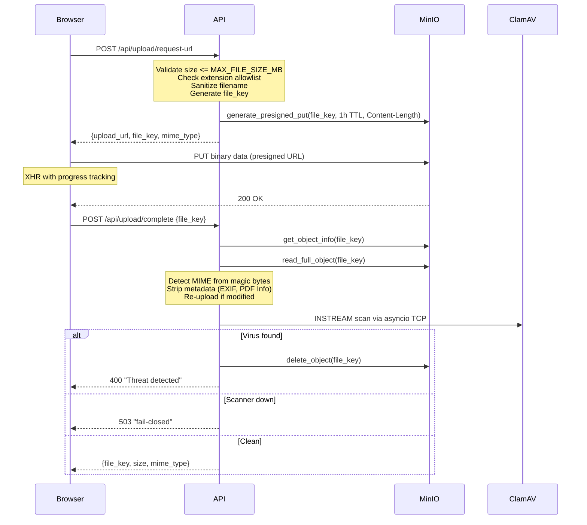

# File Upload

File uploads use a two-phase presigned URL pattern: the API generates a temporary upload URL, the browser uploads directly to MinIO, then the API verifies the file (MIME detection, metadata stripping, and ClamAV virus scan — all synchronous).

**Key files**: `api/app/routers/upload.py`, `api/app/core/minio.py`, `api/app/schemas/material.py`

---

## Upload Flow



---

## Endpoints

### POST `/api/upload/request-url`

**Auth**: Required (CurrentUser).

**Request** (`UploadRequestIn`):
```json
{
  "filename": "cours-analyse.pdf",
  "size": 2097152,
  "mime_type": "application/pdf"
}
```

**Validation**:
- `size` must be <= `MAX_FILE_SIZE_MB` (default 100 MiB, configurable via `.env`)
- `filename` sanitized: path components stripped, control characters removed (U+0000–U+001F, U+007F), Unicode bidirectional overrides and zero-width characters stripped, spaces and URL-unsafe characters replaced with underscores
- **Extension allowlist**: Only viewer-supported file types are accepted (documents, images, audio, video, Office, code/text). Note: `.xml` is explicitly excluded to prevent SVG smuggling/XSS bypasses. Unsupported extensions are rejected with 400 before a presigned URL is generated.
- MIME type is requested by the client, but the server will forcefully overwrite it with an authoritative MIME type during the `complete` step to prevent MIME spoofing.
- **Rate limit**: 10 requests per minute, 100 per day (per user). Exceeding the daily limit flags the user account.
- **Pending cap**: Max 50 pending uploads per user in storage. Excess requests are rejected with 400.

**File key format**: `uploads/{user_id}/{uuid4()}/{sanitized_filename}`

**Presigned URL enforcement**: The presigned PUT URL includes the declared `Content-Length` in its signing conditions, so S3 rejects any upload whose actual size does not match the declared size.

**Response** (`UploadRequestOut`):
```json
{
  "upload_url": "https://minio:9000/wikint/uploads/...?X-Amz-Signature=...",
  "file_key": "uploads/user-uuid/random-uuid/cours-analyse.pdf",
  "mime_type": "application/pdf"
}
```

### POST `/api/upload/complete`

**Auth**: Required (CurrentUser).

**Request** (`UploadCompleteIn`): `{"file_key": "uploads/user-uuid/..."}`

**Validation**: `file_key` must match `^uploads/{uuid}/{uuid}/{filename}$` (schema regex) and start with `uploads/{current_user_id}/` (ownership check).

**Rate limit**: Same as `request-url` (10/min, 100/day per user).

**Scan caching**: Results are cached in Redis (`upload:scanned:{file_key}`, 1h TTL). Repeated calls for an already-scanned-clean file return the cached result immediately — ClamAV is never re-invoked. This makes retries idempotent and prevents scan-amplification DoS.

**Logic**:
1. Check Redis scan cache — if this `file_key` was already scanned clean, return cached result immediately
2. Get object metadata from MinIO (size, content-type)
3. Verify actual file size <= `MAX_FILE_SIZE_MB` (the presigned PUT to MinIO does not enforce the declared size; oversized files are deleted and rejected)
4. Read first 2048 bytes for MIME detection (does not load full file)
5. Detect real MIME type from file header bytes; if the extension doesn't match, rename the file with the correct extension (via `move_object`)
6. **Authoritative MIME Enforcement**: The server calculates an authoritative MIME type (from magic bytes, falling back to extension-guessing for text formats) and unconditionally overwrites the MinIO object's `ContentType` if it differs. This strips any malicious MIME type requested by the client during the presigned PUT and prevents Stored XSS.
7. **Files <= 50 MB** (`LARGE_FILE_THRESHOLD`, loaded into memory):
   - SVG safety check: decodes content from multiple encodings (UTF-8, UTF-16, etc.) and unescapes HTML entities before pattern matching. Rejects SVGs containing `<script>`, `<foreignObject>`, `<iframe>`, `<embed>`, `<object>`, event handler attributes like `onload=`, `javascript:` / `vbscript:` URIs, or `data:text/html`.
   - Strip metadata (EXIF for images, PDF Info/XMP for PDFs, audio tags); re-upload cleaned bytes
   - ClamAV INSTREAM scan from in-memory bytes
8. **SVG size cap**: SVG files must be under 50 MiB (`LARGE_FILE_THRESHOLD`). Larger SVGs are rejected because SVG safety checks (script/event-handler detection) only run on the small-file path. This prevents bypassing SVG validation by uploading an oversized file.
9. **Files > 50 MB** (streamed):
   - ClamAV INSTREAM scan streamed directly from S3 (peak memory: ~8 KB)
   - No metadata stripping (only applies to files < 50 MB)
10. If threat: delete file, return 400
11. If scanner unavailable or error: reject upload (fail-closed, 503)
12. Cache scan result in Redis

**Response** (`UploadCompleteOut`): `{"file_key": "...", "size": 2097152, "mime_type": "application/pdf"}`

> **Note**: The returned `file_key` may differ from the one provided in `request-url` if a MIME mismatch was detected and the file was renamed with the correct extension. Clients must use the `file_key` from this response (not the one from `request-url`) for all subsequent operations.

**Error responses**:
- `400 "File type '.exe' is not supported"` — extension not in allowlist (from `request-url`)
- `400 "Uploaded file exceeds maximum size"` — actual file in MinIO exceeds `MAX_FILE_SIZE_MB` (from `complete`)
- `400 "SVG files must be under 50 MiB"` — SVG exceeds `LARGE_FILE_THRESHOLD`; rejected to ensure SVG safety checks run
- `400 "SVG files containing scripts or active content are not allowed"` — SVG with dangerous content (scripts, event handlers, `javascript:` URIs, `<foreignObject>`, `<iframe>`, `<embed>`, `<object>`)
- `400 "File failed virus scan"` — ClamAV detected a threat; file deleted from storage
- `503 "Virus scanner unavailable — file rejected (fail-closed)"` — ClamAV daemon is down or unresponsive

---

## ClamAV INSTREAM Scan

Virus scanning is synchronous and inline: every file is scanned before `upload/complete` returns a `file_key`. The scanner uses a zero-dependency async TCP client (no `aioclamd` or similar library).

**Protocol** (newline-terminated mode):
1. Open TCP connection to `clamav:3310`
2. Send `nINSTREAM\n`
3. Send file data in 8KB chunks: `[4-byte big-endian length][chunk data]`
4. Send end-of-stream marker: 4 zero bytes
5. Read response line (newline-terminated)

**Response parsing**:
- `stream: OK\n` → file is clean
- `stream: <threat-name> FOUND\n` → file is infected; file is deleted, 400 returned
- Anything else → scanner error; 503 returned (fail-closed)

**Timeout**: `clamav_scan_timeout_base + (file_size_gb × clamav_scan_timeout_per_gb)` seconds.

**Fail-closed**: If ClamAV is unreachable, connection times out, or returns an unexpected response, the upload is rejected with 503. Files are never accepted without a successful scan.

---

## MIME Detection

Magic byte detection in `api/app/routers/upload.py` supports:

| Format | Magic Bytes |
|--------|-------------|
| PDF | `%PDF` |
| PNG | `\x89PNG` |
| JPEG | `\xff\xd8\xff` |
| GIF | `GIF87a` / `GIF89a` |
| WebP | `RIFF....WEBP` |
| DjVu | `AT&TFORM` |
| MP3 | `ID3` (ID3v2 header) or `\xff\xfb` / `\xff\xf3` / `\xff\xf2` (MPEG sync) |
| FLAC | `fLaC` |
| OGG | `OggS` |
| WAV | `RIFF....WAVE` |
| M4A/MP4 | `....ftyp` (offset 4) with audio brands `M4A `, `M4B `, `isom`, `mp42` |
| ZIP-based | `PK\x03\x04` → then checks for EPUB, ODF, OOXML |
| OLE2 | `\xd0\xcf\x11\xe0` (legacy Office) |

For ZIP-based formats, the code reads into the archive to distinguish between EPUB (`mimetype` entry), ODF (OpenDocument), and OOXML (Office XML) files.

---

## MinIO Operations

`api/app/core/minio.py` provides an async S3 wrapper:

| Function | Purpose |
|----------|---------|
| `get_s3_client()` | Context manager yielding aioboto3 S3 client |
| `generate_presigned_put(key, ttl)` | Upload URL (default 1h) |
| `generate_presigned_get(key, ttl)` | Download URL (default 15min) |
| `object_exists(key)` | Check if file exists |
| `get_object_info(key)` | Returns size and content-type |
| `move_object(src, dst)` | Copy then delete |
| `delete_object(key)` | Remove file |
| `read_full_object(key)` | Read entire object into memory |
| `read_object_bytes(key, n)` | Stream first N bytes |
| `stream_object(key)` | Context manager yielding S3 body for chunked reads |
| `update_object_content_type(key, ct)` | Update metadata |

If `settings.minio_public_endpoint` is configured, presigned URLs rewrite only the host portion (`netloc`) via `urllib.parse`, leaving the path and query signature intact.

---

## File Lifecycle

1. **Upload**: Browser → MinIO at `uploads/{user_id}/{uuid}/{filename}`
2. **Complete**: API verifies MIME (renames file if extension mismatches detected content), strips metadata (files <= 50 MB), and scans with ClamAV INSTREAM. Files > 50 MB are streamed directly from S3 to ClamAV. The returned `file_key` may differ from the original if the extension was corrected. By the time `file_key` is returned, the file is guaranteed clean.
3. **Staging**: Frontend stores the `file_key` from the `complete` response (not `request-url`) in the staging store
4. **PR submission**: `file_key` validated to belong to user, confirmed to exist in storage, and verified against the Redis scan cache (`upload:scanned:{file_key}`). Files that haven't completed `complete_upload` (i.e., haven't been virus-scanned) are rejected.
5. **Finalization**: `move_object` moves files from `uploads/` to permanent storage, which immediately frees up the user's pending upload quota:
    - **Materials**: When PR is approved (`materials/` prefix)
    - **Avatars**: When user profile is updated (`avatars/` prefix)
6. **Serving**: Presigned GET URLs generated for download/inline viewing
7. **Cleanup**: `cleanup_uploads` cron job deletes files in `uploads/` older than 24h (skips files referenced by open PRs)

---

## Security Notes

### Metadata Stripping (Fail-Open)

Metadata stripping (`strip_metadata`) is fail-open by design: if Pillow, pikepdf, mutagen, or ffmpeg cannot process a file, the original bytes are kept and the upload proceeds. This is a deliberate trade-off — rejecting files due to metadata-stripping bugs would block legitimate uploads. The ClamAV scan still runs after stripping, so malware is always caught regardless of whether stripping succeeded.

Formats processed by `strip_metadata`:

| Format | Library | What is stripped |
|--------|---------|------------------|
| Images (JPEG, PNG, WebP, GIF) | Pillow | EXIF data (GPS, camera info, timestamps) |
| PDF | pikepdf | Document Info dict, XMP metadata |
| Video (MP4, WebM, OGG) | ffmpeg | All global/stream metadata (stream-copied, no re-encoding) |
| Audio (MP3, FLAC, OGG, WAV, M4A) | mutagen | ID3 tags, Vorbis comments, MP4 atoms |

### Audio MIME Verification

Most audio formats (MP3, FLAC, OGG, WAV, M4A) have magic-byte detection and are verified against their file extension. Standalone AAC (`.aac`) files lack a reliable magic signature and bypass the extension/content mismatch check. Audio metadata is stripped via mutagen and ClamAV scans all files regardless.

### OOXML Metadata Not Stripped

Office XML formats (`.docx`, `.xlsx`, `.pptx`) are not processed by `strip_metadata`. These files may contain author names, revision history, and other metadata in their XML properties. OOXML stripping would require unpacking and repacking ZIP archives, adding complexity and risk of file corruption.
