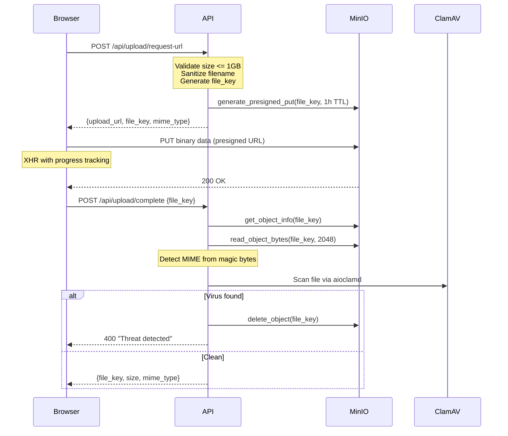

# File Upload

File uploads use a two-phase presigned URL pattern: the API generates a temporary upload URL, the browser uploads directly to MinIO, then the API verifies the file (MIME detection + virus scan).

**Key files**: `api/app/routers/upload.py`, `api/app/core/minio.py`, `api/app/schemas/material.py`

---

## Upload Flow



---

## Endpoints

### POST `/api/upload/request-url`

**Auth**: Required (CurrentUser).

**Request** (`UploadRequestIn`):
```json
{
  "filename": "cours-analyse.pdf",
  "size": 2097152,
  "mime_type": "application/pdf"
}
```

**Validation**:
- `size` must be <= 1 GB (1073741824 bytes)
- `filename` sanitized: path components stripped, null bytes removed
- MIME type guessed from filename if the provided value is `application/octet-stream`

**File key format**: `uploads/{user_id}/{uuid4()}/{sanitized_filename}`

**Response** (`UploadRequestOut`):
```json
{
  "upload_url": "https://minio:9000/wikint/uploads/...?X-Amz-Signature=...",
  "file_key": "uploads/user-uuid/random-uuid/cours-analyse.pdf",
  "mime_type": "application/pdf"
}
```

### POST `/api/upload/complete`

**Auth**: Required (CurrentUser).

**Request** (`UploadCompleteIn`): `{"file_key": "uploads/user-uuid/..."}`

**Validation**: `file_key` must start with `uploads/{current_user_id}/` (ownership check).

**Logic**:
1. Get object metadata from MinIO (size, content-type)
2. Read first 2048 bytes for magic byte detection
3. Detect real MIME type from file header bytes
4. Run ClamAV scan with dynamic timeout: `base + (file_size_gb * per_gb_timeout)`
5. If threat: delete file, return 400
6. If scanner unavailable: reject upload (fail-closed)

**Response** (`UploadCompleteOut`): `{"file_key": "...", "size": 2097152, "mime_type": "application/pdf"}`

---

## MIME Detection

Magic byte detection in `api/app/routers/upload.py` supports:

| Format | Magic Bytes |
|--------|-------------|
| PDF | `%PDF` |
| PNG | `\x89PNG` |
| JPEG | `\xff\xd8\xff` |
| GIF | `GIF87a` / `GIF89a` |
| WebP | `RIFF....WEBP` |
| DjVu | `AT&TFORM` |
| ZIP-based | `PK\x03\x04` → then checks for EPUB, ODF, OOXML |
| OLE2 | `\xd0\xcf\x11\xe0` (legacy Office) |

For ZIP-based formats, the code reads into the archive to distinguish between EPUB (`mimetype` entry), ODF (OpenDocument), and OOXML (Office XML) files.

---

## MinIO Operations

`api/app/core/minio.py` provides an async S3 wrapper:

| Function | Purpose |
|----------|---------|
| `get_s3_client()` | Context manager yielding aioboto3 S3 client |
| `generate_presigned_put(key, ttl)` | Upload URL (default 1h) |
| `generate_presigned_get(key, ttl)` | Download URL (default 15min) |
| `object_exists(key)` | Check if file exists |
| `get_object_info(key)` | Returns size and content-type |
| `move_object(src, dst)` | Copy then delete |
| `delete_object(key)` | Remove file |
| `read_object_bytes(key, n)` | Stream first N bytes |
| `update_object_content_type(key, ct)` | Update metadata |

If `settings.minio_public_endpoint` is configured, presigned GET URLs use the public endpoint instead of the internal Docker hostname.

---

## File Lifecycle

1. **Upload**: Browser → MinIO at `uploads/{user_id}/{uuid}/{filename}`
2. **Virus scan**: API reads bytes, scans with ClamAV
3. **Staging**: File key stored in staged PR operation (frontend `staging-store`)
4. **PR submission**: `file_key` validated to belong to user
5. **PR approval**: `_exec_create_material` / `_exec_edit_material` calls `move_object` to move from `uploads/` to `materials/`
6. **Serving**: Presigned GET URLs generated for download/inline viewing
7. **Cleanup**: `cleanup_uploads` cron job deletes files in `uploads/` older than 24h
