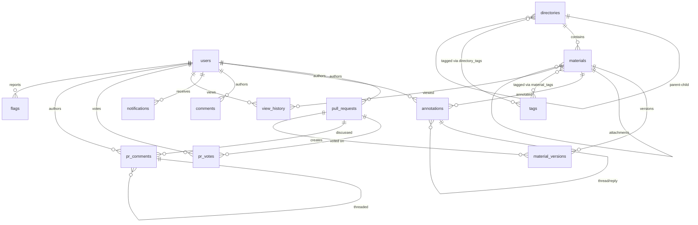

# Data Model

WikINT uses PostgreSQL 16 with SQLAlchemy 2.0+ async ORM. The schema comprises 15 tables, 2 junction tables, and 2 SQL views. All primary keys are UUIDs generated server-side via `gen_random_uuid()`.

This document covers every model, column, relationship, and design pattern in the database layer.

---

## Entity-Relationship Diagram



---

## Base Classes

Defined in `api/app/models/base.py`:

### UUIDMixin
```python
class UUIDMixin:
    id: Mapped[uuid.UUID] = mapped_column(
        UUID, primary_key=True, default=uuid.uuid4,
        server_default=func.gen_random_uuid()
    )
```

### TimestampMixin
```python
class TimestampMixin:
    created_at: Mapped[datetime] = mapped_column(DateTime(timezone=True), server_default=func.now())
    updated_at: Mapped[datetime] = mapped_column(DateTime(timezone=True), server_default=func.now(), onupdate=func.now())
```

---

## Models

### User (`api/app/models/user.py`)

| Column | Type | Constraints | Notes |
|--------|------|-------------|-------|
| `id` | UUID | PK | From UUIDMixin |
| `email` | VARCHAR(255) | UNIQUE, NOT NULL | School email |
| `display_name` | VARCHAR(100) | Nullable | Set during onboarding |
| `avatar_url` | VARCHAR(500) | Nullable | S3 file_key |
| `role` | Enum(UserRole) | DEFAULT 'student' | student/member/bureau/vieux |
| `bio` | TEXT | Nullable | |
| `academic_year` | VARCHAR(10) | Nullable | "1A", "2A", "3A+" |
| `gdpr_consent` | BOOLEAN | DEFAULT false | |
| `gdpr_consent_at` | DATETIME(tz) | Nullable | When consent given |
| `onboarded` | BOOLEAN | DEFAULT false | |
| `created_at` | DATETIME(tz) | server_default=now() | |
| `last_login_at` | DATETIME(tz) | Nullable | Updated on each login |
| `deleted_at` | DATETIME(tz) | Nullable | Soft delete marker |

**Enum: UserRole** — `student`, `member`, `bureau`, `vieux`

**Relationships**: `pull_requests`, `annotations`, `comments`, `notifications` (cascade delete-orphan)

**Index**: `idx_users_deleted_at`

---

### Directory (`api/app/models/directory.py`)

| Column | Type | Constraints | Notes |
|--------|------|-------------|-------|
| `id` | UUID | PK | |
| `parent_id` | UUID | FK(directories), ON DELETE CASCADE, Nullable | Self-referential tree |
| `name` | VARCHAR(200) | NOT NULL | Display name |
| `slug` | VARCHAR(200) | NOT NULL | URL segment |
| `type` | Enum(DirectoryType) | NOT NULL | module/folder |
| `description` | TEXT | Nullable | |
| `metadata_` | JSONB | DEFAULT {} | Flexible key-value (e.g., course code) |
| `sort_order` | INTEGER | DEFAULT 0 | Display ordering |
| `is_system` | BOOLEAN | DEFAULT false | System-created (e.g., attachments dirs) |
| `created_by` | UUID | FK(users), ON DELETE SET NULL | |
| `created_at` | DATETIME(tz) | From TimestampMixin | |
| `updated_at` | DATETIME(tz) | From TimestampMixin | |

**Enum: DirectoryType** — `module`, `folder`

**Unique constraint**: `(parent_id, slug)` — slugs unique within parent

**Relationships**: `parent`, `children` (cascade delete-orphan), `materials` (cascade delete-orphan), `tags` (M2M via `directory_tags`)

---

### Material (`api/app/models/material.py`)

| Column | Type | Constraints | Notes |
|--------|------|-------------|-------|
| `id` | UUID | PK | |
| `directory_id` | UUID | FK(directories), ON DELETE CASCADE | Parent folder |
| `title` | VARCHAR(300) | NOT NULL | |
| `slug` | VARCHAR(300) | NOT NULL | URL segment |
| `description` | TEXT | Nullable | |
| `type` | VARCHAR(50) | NOT NULL | polycopie, annal, cheatsheet, etc. |
| `current_version` | INTEGER | DEFAULT 1 | Latest version number |
| `parent_material_id` | UUID | FK(materials), ON DELETE CASCADE, Nullable | For attachments |
| `author_id` | UUID | FK(users), ON DELETE SET NULL | |
| `metadata_` | JSONB | DEFAULT {} | e.g., video_url |
| `download_count` | INTEGER | DEFAULT 0 | |
| `created_at` | DATETIME(tz) | From TimestampMixin | |
| `updated_at` | DATETIME(tz) | From TimestampMixin | |

**Unique constraint**: `(directory_id, slug)`

**Relationships**: `directory`, `author`, `versions` (ordered by version_number, cascade delete-orphan), `parent_material`, `tags` (M2M via `material_tags`), `annotations` (cascade delete-orphan)

---

### MaterialVersion (`api/app/models/material.py`)

| Column | Type | Constraints | Notes |
|--------|------|-------------|-------|
| `id` | UUID | PK | |
| `material_id` | UUID | FK(materials), ON DELETE CASCADE | |
| `version_number` | INTEGER | NOT NULL | |
| `file_key` | VARCHAR(500) | Nullable | S3 object path |
| `file_name` | VARCHAR(300) | Nullable | Original filename |
| `file_size` | BIGINT | Nullable | Bytes |
| `file_mime_type` | VARCHAR(100) | Nullable | |
| `diff_summary` | TEXT | Nullable | Description of changes |
| `author_id` | UUID | FK(users), ON DELETE SET NULL | |
| `pr_id` | UUID | FK(pull_requests), ON DELETE SET NULL | PR that created this version |
| `created_at` | DATETIME(tz) | server_default=now() | |

**Unique constraint**: `(material_id, version_number)`

---

### Tag (`api/app/models/tag.py`)

| Column | Type | Constraints | Notes |
|--------|------|-------------|-------|
| `id` | UUID | PK | |
| `name` | VARCHAR(100) | UNIQUE, NOT NULL | Normalized lowercase |
| `category` | VARCHAR(50) | Nullable | Grouping (subject, difficulty, etc.) |

**Junction Tables**:
- `material_tags` — composite PK `(material_id, tag_id)`, both cascade delete
- `directory_tags` — composite PK `(directory_id, tag_id)`, both cascade delete

---

### Annotation (`api/app/models/annotation.py`)

| Column | Type | Constraints | Notes |
|--------|------|-------------|-------|
| `id` | UUID | PK | |
| `material_id` | UUID | FK(materials), ON DELETE CASCADE | |
| `version_id` | UUID | FK(material_versions), ON DELETE SET NULL | Pinned to version |
| `author_id` | UUID | FK(users), ON DELETE SET NULL | |
| `body` | TEXT | NOT NULL | 1-1000 chars |
| `page` | INTEGER | Nullable | Document page number |
| `selection_text` | TEXT | Nullable | Quoted text |
| `position_data` | JSONB | Nullable | Coordinates for positioning |
| `thread_id` | UUID | FK(annotations), ON DELETE CASCADE | Root of thread (self-ref) |
| `reply_to_id` | UUID | FK(annotations), ON DELETE SET NULL | Direct parent reply |
| `created_at` | DATETIME(tz) | From TimestampMixin | |
| `updated_at` | DATETIME(tz) | From TimestampMixin | |

**Threading**: Root annotations have `thread_id = own id`. Replies set `thread_id` to the root and `reply_to_id` to the direct parent.

---

### Comment (`api/app/models/comment.py`)

| Column | Type | Constraints | Notes |
|--------|------|-------------|-------|
| `id` | UUID | PK | |
| `target_type` | VARCHAR(20) | NOT NULL | "material" or "directory" |
| `target_id` | UUID | NOT NULL | ID of target entity |
| `author_id` | UUID | FK(users), ON DELETE SET NULL | |
| `body` | TEXT | NOT NULL | 1-10000 chars |
| `created_at` | DATETIME(tz) | From TimestampMixin | |
| `updated_at` | DATETIME(tz) | From TimestampMixin | |

**Index**: `(target_type, target_id, created_at)`

**Design**: Polymorphic association — `(target_type, target_id)` can point to any entity without FK constraints.

---

### Flag (`api/app/models/flag.py`)

| Column | Type | Constraints | Notes |
|--------|------|-------------|-------|
| `id` | UUID | PK | |
| `reporter_id` | UUID | FK(users), ON DELETE SET NULL | |
| `target_type` | VARCHAR(20) | NOT NULL | material/annotation/pull_request/comment/pr_comment |
| `target_id` | UUID | NOT NULL | |
| `reason` | VARCHAR(50) | NOT NULL | inappropriate/copyright/spam/incorrect/other |
| `description` | TEXT | Nullable | |
| `status` | Enum(FlagStatus) | DEFAULT 'open' | |
| `resolved_by` | UUID | FK(users), ON DELETE SET NULL | |
| `resolved_at` | DATETIME(tz) | Nullable | |
| `created_at` | DATETIME(tz) | server_default=now() | |

**Enum: FlagStatus** — `open`, `reviewing`, `resolved`, `dismissed`

**Unique constraint**: `(reporter_id, target_type, target_id)` — one flag per user per target

---

### Notification (`api/app/models/notification.py`)

| Column | Type | Constraints | Notes |
|--------|------|-------------|-------|
| `id` | UUID | PK | |
| `user_id` | UUID | FK(users), ON DELETE CASCADE | |
| `type` | VARCHAR(50) | NOT NULL | pr_approved, annotation_reply, etc. |
| `title` | VARCHAR(300) | NOT NULL | |
| `body` | TEXT | Nullable | |
| `link` | VARCHAR(500) | Nullable | UI navigation target |
| `read` | BOOLEAN | DEFAULT false | |
| `created_at` | DATETIME(tz) | server_default=now() | |

**Index**: `(user_id, read, created_at)` — optimizes "unread notifications" queries

---

### PullRequest (`api/app/models/pull_request.py`)

| Column | Type | Constraints | Notes |
|--------|------|-------------|-------|
| `id` | UUID | PK | |
| `type` | VARCHAR(50) | DEFAULT 'batch' | Always "batch" since migration 002 |
| `status` | Enum(PRStatus) | DEFAULT 'open' | |
| `title` | VARCHAR(300) | NOT NULL | |
| `description` | TEXT | Nullable | |
| `payload` | JSONB | NOT NULL | Array of operation objects |
| `summary_types` | JSONB | DEFAULT [] | Extracted operation type strings |
| `author_id` | UUID | FK(users), ON DELETE SET NULL | |
| `reviewed_by` | UUID | FK(users), ON DELETE SET NULL | |
| `created_at` | DATETIME(tz) | From TimestampMixin | |
| `updated_at` | DATETIME(tz) | From TimestampMixin | |

**Enum: PRStatus** — `open`, `approved`, `rejected`

**Relationships**: `author`, `reviewer`, `votes` (cascade delete-orphan), `comments` (cascade delete-orphan)

---

### PRVote (`api/app/models/pull_request.py`)

| Column | Type | Constraints | Notes |
|--------|------|-------------|-------|
| `id` | UUID | PK | |
| `pr_id` | UUID | FK(pull_requests), ON DELETE CASCADE | |
| `user_id` | UUID | FK(users), ON DELETE CASCADE | |
| `value` | SMALLINT | CHECK(value IN (-1, 1)) | Upvote or downvote |
| `created_at` | DATETIME(tz) | server_default=now() | |

**Unique constraint**: `(pr_id, user_id)` — one vote per user per PR

---

### PRComment (`api/app/models/pull_request.py`)

| Column | Type | Constraints | Notes |
|--------|------|-------------|-------|
| `id` | UUID | PK | |
| `pr_id` | UUID | FK(pull_requests), ON DELETE CASCADE | |
| `author_id` | UUID | FK(users), ON DELETE SET NULL | |
| `body` | TEXT | NOT NULL | |
| `parent_id` | UUID | FK(pr_comments), ON DELETE CASCADE, Nullable | Threaded replies |
| `created_at` | DATETIME(tz) | From TimestampMixin | |
| `updated_at` | DATETIME(tz) | From TimestampMixin | |

---

### ViewHistory (`api/app/models/view_history.py`)

| Column | Type | Constraints | Notes |
|--------|------|-------------|-------|
| `id` | UUID | PK | |
| `user_id` | UUID | FK(users), ON DELETE CASCADE | |
| `material_id` | UUID | FK(materials), ON DELETE CASCADE | |
| `viewed_at` | DATETIME(tz) | server_default=now() | Upserted on repeat views |

**Unique constraint**: `(user_id, material_id)` — one record per user-material pair (updates `viewed_at`)

**Index**: `(user_id, viewed_at)` — optimizes "recently viewed" queries

---

## SQL Views

Defined in `api/app/migrations/versions/001_initial.py`:

### `pull_requests_with_score`
Extends `pull_requests` with vote aggregates:
- `vote_score`: `SUM(pr_votes.value)`
- `upvotes`: `COUNT WHERE value = 1`
- `downvotes`: `COUNT WHERE value = -1`

### `user_stats`
Denormalized per-user statistics:
- `prs_approved`, `prs_total`, `annotations_count`, `comments_count`, `open_pr_count`

---

## Design Patterns

### Soft Deletes
The `User` model uses `deleted_at` for soft deletion. Queries filter `WHERE deleted_at IS NULL`. After 30 days, the `gdpr_cleanup` worker hard-deletes the record.

### Polymorphic Associations
`Comment` and `Flag` use a `(target_type, target_id)` tuple instead of multiple FK columns. This allows attaching comments/flags to any entity without schema changes. The trade-off is no FK constraint enforcement — validation happens in the service layer.

### Self-Referential Trees
- **Directory**: `parent_id` → hierarchical folder tree
- **Annotation**: `thread_id` → root of discussion, `reply_to_id` → direct parent
- **PRComment**: `parent_id` → threaded discussion

### JSONB Columns
- `Material.metadata_` / `Directory.metadata_` — extensible key-value (course codes, video URLs, etc.)
- `PullRequest.payload` — stores the full array of batch operations as structured JSON
- `Annotation.position_data` — PDF coordinates for annotation positioning

### Versioning
Materials track versions via `MaterialVersion`. Each version records the file, author, and optionally the PR that created it. `Material.current_version` points to the latest version number.

---

## Migration History

| Revision | Date | Description |
|----------|------|-------------|
| `001_initial` | Initial | Creates all 15 tables, 2 junction tables, 2 views, 5 enum types |
| `002_batch_pr_upgrade` | 2026-03-11 | Converts PRs from single-operation to batch. Wraps payload in arrays, changes type column from enum to varchar "batch", adds summary_types JSONB |
| `016ff5f329ae` | 2026-03-13 | Fixes summary_types containing null values from migration 002 |

Migrations use Alembic with async engine support (`api/app/migrations/env.py`). Configuration in `api/alembic.ini`.
