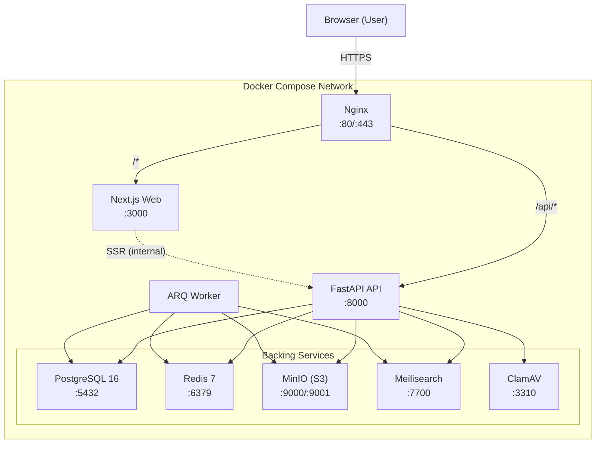
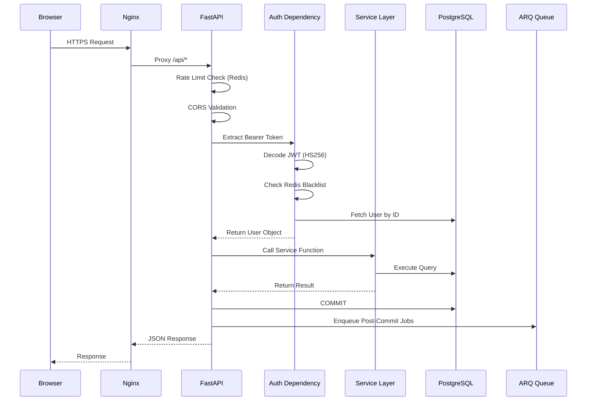
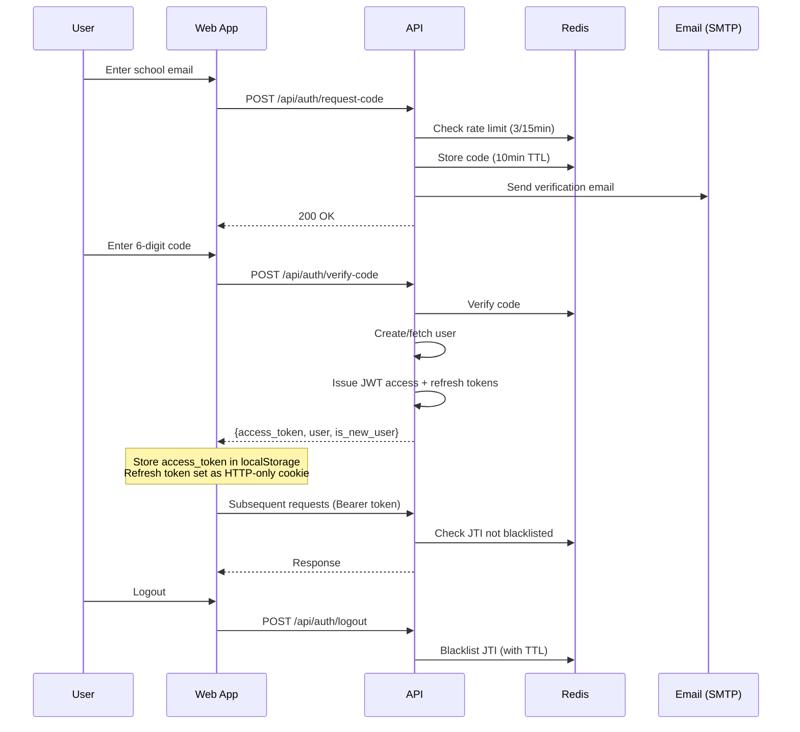
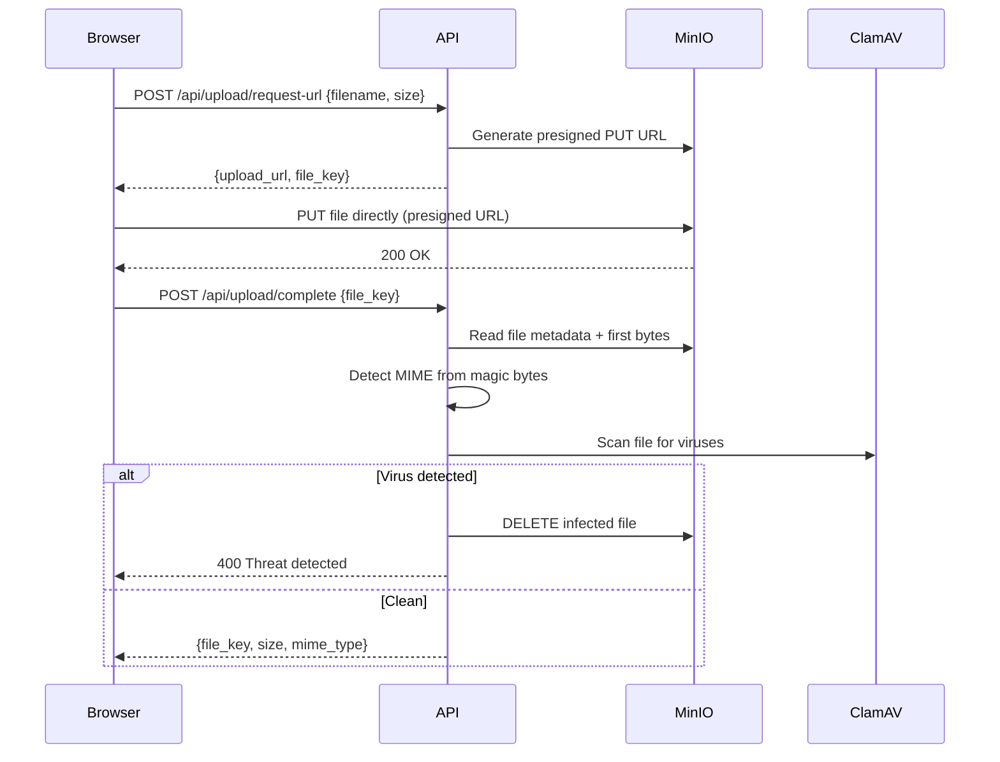
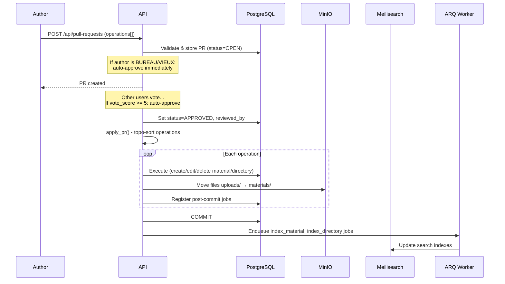

# System Architecture Overview

WikINT is a collaborative academic materials platform for Telecom SudParis and IMT-BS students. It allows users to browse, upload, annotate, and review course materials through a Wikipedia/GitHub-inspired pull request workflow.

This document covers the high-level architecture, service topology, request lifecycle, and key data flows.

---

## Service Topology



---

## Service Responsibilities

| Service | Technology | Role |
|---------|-----------|------|
| **Nginx** | nginx:alpine | Reverse proxy, SSL termination, static routing. Routes `/api/*` to API, everything else to Web |
| **Web** | Next.js 16 / React 19 | Server-rendered frontend. All user-facing UI, client-side state, file viewers |
| **API** | FastAPI + Uvicorn | REST API. Authentication, business logic, file orchestration, SSE streaming |
| **Worker** | ARQ (async Redis queue) | Background tasks: search indexing, upload cleanup, GDPR purge, academic year rollover |
| **PostgreSQL** | PostgreSQL 16 | Primary data store. 15 tables, 2 junction tables, 2 SQL views |
| **Redis** | Redis 7 | Rate limiting, JWT blacklist, ARQ job queue, SSE state |
| **MinIO** | MinIO (S3-compatible) | File storage for all uploaded materials. Presigned URLs for upload/download |
| **Meilisearch** | Meilisearch 1.12 | Full-text search with typo tolerance across materials and directories |
| **ClamAV** | ClamAV daemon | Virus scanning for all uploaded files. Fail-closed design |

Configuration for all services lives in `docker-compose.yml` (production) and `docker-compose.dev.yml` (development overrides).

---

## Application Bootstrap

The FastAPI application is assembled in `api/app/main.py`:

```python
# Lifespan: init Meilisearch indexes + ARQ pool on startup, close Redis on shutdown
@asynccontextmanager
async def lifespan(app: FastAPI):
    await setup_meilisearch()
    await init_arq_pool()
    yield
    await close_arq_pool()
```

**Middleware stack** (applied to every request):
1. **CORS** — allows requests from `settings.frontend_url`
2. **Rate limiting** — slowapi with Redis backend, 60 req/min (disabled in dev)
3. **Request logging** — logs method, path, status code, execution time

**Router registration** — 13 routers covering auth, users, materials, directories, browse, search, upload, pull requests, PR comments, annotations, comments, flags, notifications, and admin.

In development mode, **SQLAdmin** provides a web-based database administration interface at `/admin` for 9 model types.

---

## Request Lifecycle



**Key design**: Database sessions use a post-commit job pattern (`api/app/core/database.py`). Services register background jobs in `session.info["post_commit_jobs"]`. After the transaction commits successfully, the `get_db` dependency enqueues them to ARQ. This ensures jobs only run when data has actually persisted.

---

## Authentication Flow



Access tokens (7-day expiry) contain `user_id`, `role`, `email`, and `jti`. The `jti` (JWT ID) enables individual token revocation via Redis blacklist. Refresh tokens (31-day) are HTTP-only cookies scoped to `/api/auth/refresh`.

---

## File Upload Flow



Files are uploaded via presigned URLs directly to MinIO, bypassing the API server for large files. The key format is `uploads/{user_id}/{uuid}/{filename}`. When a pull request is approved, files are moved from `uploads/` to `materials/`.

---

## Pull Request Approval Flow



---

## Real-Time Features (SSE)

The system uses **Server-Sent Events** for two real-time channels:

### Notification SSE
- Endpoint: `GET /api/notifications/sse?token=` (token in query param because EventSource cannot send headers)
- Server maintains `_sse_queues: Dict[user_id → asyncio.Queue]` in `api/app/services/notification.py`
- Events: `notification` (new notification data), `ping` (30s keepalive)
- Multi-tab coordination on the frontend uses **BroadcastChannel API**: first tab becomes "leader" and opens the EventSource, others listen via the channel

### Material Annotation SSE
- Endpoint: `GET /api/materials/{id}/sse`
- Server maintains `_material_queues: Dict[material_id → list[asyncio.Queue]]`
- Events: `annotation_created`, `annotation_deleted`, `ping`
- Enables collaborative annotation — all users viewing the same material see new annotations in real time

---

## Background Worker Architecture

The ARQ worker (`api/app/workers/settings.py`) runs as a separate container consuming jobs from Redis.

**On-demand tasks** (enqueued via post-commit jobs):
| Task | File | Trigger |
|------|------|---------|
| `index_material` | `api/app/workers/index_content.py` | Material created/edited via PR |
| `index_directory` | `api/app/workers/index_content.py` | Directory created/edited via PR |
| `delete_indexed_item` | `api/app/workers/index_content.py` | Material/directory deleted via PR |
| `process_upload` | `api/app/workers/process_upload.py` | File upload completed |

**Scheduled cron jobs**:
| Task | File | Schedule | Purpose |
|------|------|----------|---------|
| `cleanup_uploads` | `api/app/workers/cleanup_uploads.py` | Daily 3:00 AM | Delete stale uploads older than 24h |
| `gdpr_cleanup` | `api/app/workers/gdpr_cleanup.py` | Daily 4:00 AM | Hard-delete users soft-deleted 30+ days ago |
| `year_rollover` | `api/app/workers/year_rollover.py` | Sept 1, 2:00 AM | Promote academic years (1A→2A→3A+) |
