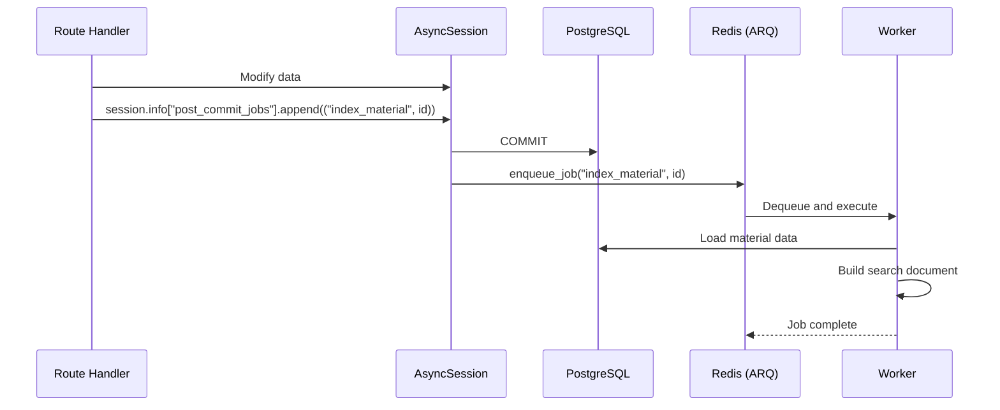

# Background Workers (ARQ)

WikINT uses ARQ (Async Redis Queue) for background job processing. A dedicated `worker` container runs the same codebase as the API but executes queued functions and cron jobs instead of serving HTTP requests.

**Key files**: `api/app/workers/settings.py`, `api/app/workers/process_upload.py`, `api/app/workers/cleanup_uploads.py`, `api/app/workers/gdpr_cleanup.py`, `api/app/workers/year_rollover.py`, `api/app/workers/index_content.py`

---

## Worker Configuration

`api/app/workers/settings.py` defines the `WorkerSettings` class:

```python
class WorkerSettings:
    redis_settings = RedisSettings.from_dsn(settings.redis_url)
    functions = [process_upload, index_material, index_directory, delete_indexed_item]
    cron_jobs = [
        cron(cleanup_uploads, hour=3, minute=0),
        cron(gdpr_cleanup, hour=4, minute=0),
        cron(year_rollover, month={9}, day=1, hour=2, minute=0),
    ]
    on_startup = startup
    on_shutdown = shutdown
```

The worker is started with: `uv run arq app.workers.settings.WorkerSettings`

---

## On-Demand Functions

These functions are enqueued by the API via the post-commit job pattern.

### `process_upload(ctx, file_key: str)`

**File**: `api/app/workers/process_upload.py`

Processes a newly uploaded file:
- Retrieves object metadata from MinIO (size, content type)
- Logs upload information

### `index_material(ctx, material_id: UUID)`

**File**: `api/app/workers/index_content.py`

Indexes a material in Meilisearch after creation or update:
1. Loads the material with tags and author from PostgreSQL
2. Resolves the ancestor directory path via `get_directory_path()`
3. Builds `extra_searchable` using `split_identifiers()` for alphanumeric term splitting
4. Constructs the `browse_path` for frontend linking
5. Upserts the document to the `materials` Meilisearch index

### `index_directory(ctx, directory_id: UUID)`

**File**: `api/app/workers/index_content.py`

Same as `index_material` but for directories:
1. Loads directory with tags
2. Resolves ancestor path
3. Includes the `code` field from `metadata_` JSONB
4. Upserts to the `directories` Meilisearch index

### `delete_indexed_item(ctx, index_name: str, item_id: str)`

**File**: `api/app/workers/index_content.py`

Removes a document from a Meilisearch index. Used when materials or directories are deleted.

---

## Cron Jobs

### `cleanup_uploads` -- Daily at 03:00 UTC

**File**: `api/app/workers/cleanup_uploads.py`

Removes stale temporary uploads from MinIO:
1. Lists all objects under the `uploads/` prefix
2. Deletes any object with `LastModified` older than 24 hours
3. Uses S3 paginator for large result sets

This catches uploads where the user obtained a presigned URL but never completed the upload flow.

### `gdpr_cleanup` -- Daily at 04:00 UTC

**File**: `api/app/workers/gdpr_cleanup.py`

Hard-deletes soft-deleted users past the GDPR retention period:
1. Queries users where `deleted_at` is set and older than 30 days (`GDPR_RETENTION_DAYS = 30`)
2. Executes `DELETE FROM users WHERE id = ...` for each qualifying user
3. Cascading deletes remove related records (comments, annotations, etc.)

### `year_rollover` -- September 1st at 02:00 UTC

**File**: `api/app/workers/year_rollover.py`

Bumps academic years at the start of each school year:

| Current | New |
|---------|-----|
| `1A` | `2A` |
| `2A` | `3A+` |
| `3A+` | `3A+` (no change) |

Only updates non-deleted users with a non-null `academic_year`. Creates its own database engine/session (doesn't use the shared session factory).

---

## Job Dispatch Pattern



Jobs are only enqueued after a successful commit. If the transaction rolls back, no jobs are dispatched. This prevents indexing data that doesn't exist.

---

## Docker Configuration

```yaml
worker:
  build:
    context: ./api
    dockerfile: Dockerfile
  command: uv run arq app.workers.settings.WorkerSettings
  depends_on:
    postgres:
      condition: service_healthy
    redis:
      condition: service_healthy
```

The worker uses the same Docker image as the API (same `Dockerfile`, same dependencies). It receives the same environment variables except it doesn't need `CLAMAV_*`, `SMTP_*`, or `FRONTEND_URL`.

In development, the worker bind-mounts `./api:/app` for live code reloading.

---

## CLI Equivalents

All cron jobs can also be run manually via the CLI:

| Cron Job | CLI Command |
|----------|-------------|
| `gdpr_cleanup` | `docker compose exec api uv run python -m app.cli gdpr-cleanup` |
| `year_rollover` | `docker compose exec api uv run python -m app.cli year-rollover` |
| (full reindex) | `docker compose exec api uv run python -m app.cli reindex` |

The `reindex` command is not a cron job but provides a manual way to rebuild all search indexes.
