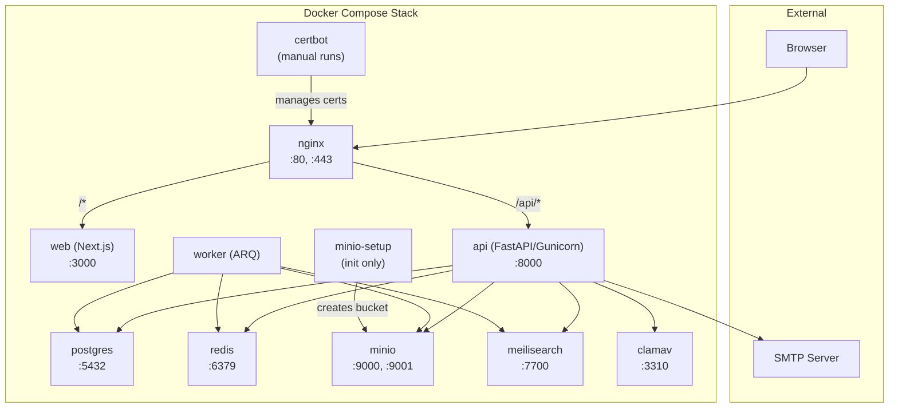

# Infrastructure Overview

WikINT runs as a Docker Compose stack of 11 services. This document covers the service topology, networking, health checks, and how production vs development modes differ.

**Key files**: `docker-compose.yml`, `docker-compose.dev.yml`, `run.sh`

---

## Service Topology



---

## Services

| Service | Image | Purpose | Ports |
|---------|-------|---------|-------|
| `postgres` | `postgres:16-alpine` | Primary database | 5432 |
| `redis` | `redis:7-alpine` | Caching, job queue, rate limiting, token blacklist | 6379 |
| `minio` | `minio/minio:latest` | S3-compatible file storage | 9000 (API), 9001 (console) |
| `minio-setup` | `minio/mc:latest` | One-shot: creates the `wikint` bucket | none |
| `meilisearch` | `getmeili/meilisearch:v1.12` | Full-text search engine | 7700 |
| `clamav` | `clamav/clamav:latest` | Antivirus scanning | 3310 |
| `api` | Custom (Python 3.12-slim) | FastAPI backend with Gunicorn (4 workers) | 8000 |
| `worker` | Custom (same as api) | ARQ background job processor | none |
| `web` | Custom (Node 20-alpine) | Next.js frontend | 3000 |
| `nginx` | `nginx:alpine` | Reverse proxy, TLS termination | 80, 443 |
| `certbot` | `certbot/certbot` | Let's Encrypt certificate management | none |

---

## Startup Order

Docker Compose `depends_on` with `condition: service_healthy` enforces this boot sequence:

```
1. postgres, redis, minio, meilisearch, clamav  (infrastructure, parallel)
2. minio-setup                                    (waits for minio healthy)
3. api                                            (waits for postgres, redis, minio)
4. worker                                         (waits for postgres, redis)
5. web                                            (waits for api)
6. nginx                                          (waits for api, web)
```

---

## Health Checks

| Service | Check | Interval | Start Period |
|---------|-------|----------|-------------|
| `postgres` | `pg_isready -U $POSTGRES_USER -d $POSTGRES_DB` | 5s | default |
| `redis` | `redis-cli ping` | 5s | default |
| `minio` | `mc ready local` | 5s | default |
| `meilisearch` | `curl -f http://localhost:7700/health` | 5s | default |
| `clamav` | `clamdcheck` | 30s | **120s** (signature download) |
| `api` | Python `urllib.request.urlopen('http://localhost:8000/api/health')` | 10s | default |

ClamAV has a 120-second start period because it must download virus signature databases before becoming ready.

---

## Production vs Development

The `run.sh` script controls which mode runs:

```bash
./run.sh --prod   # docker-compose.yml only
./run.sh --dev    # docker-compose.yml + docker-compose.dev.yml overlay
```

### Key Differences

| Aspect | Production | Development |
|--------|-----------|-------------|
| **API server** | Gunicorn with 4 Uvicorn workers | Uvicorn with `--reload` |
| **Frontend** | `node server.js` (standalone build) | `pnpm dev` (HMR) |
| **Source mounts** | None (code baked into image) | `./api:/app` and `./web:/app` bind mounts |
| **Nginx TLS** | Let's Encrypt certs | Self-signed cert auto-generated on start |
| **Nginx config** | `infra/nginx/nginx.conf` | `infra/nginx/nginx.dev.conf` |
| **Rate limiting** | Enabled (60/min via SlowAPI) | Disabled |
| **OpenAPI docs** | Disabled (`/api/docs` returns 404) | Enabled at `/api/docs` |
| **SQLAdmin** | Disabled | Enabled at `/admin` |
| **SQL echo** | Off | On (logs all queries) |
| **API port** | Accessed through nginx only | Directly exposed on `:8000` |
| **Web port** | Accessed through nginx only | Directly exposed on `:3000` |

### Development Overlay (`docker-compose.dev.yml`)

The dev compose file overrides three services:

- **api**: Bind-mounts `./api`, runs `uvicorn --reload`, exposes port 8000, loads `.env` directly
- **worker**: Bind-mounts `./api`, re-syncs deps on start
- **web**: Targets `deps` build stage, runs `pnpm dev`, bind-mounts `./web` (excluding `node_modules`), exposes port 3000
- **nginx**: Generates a self-signed cert on startup, uses `nginx.dev.conf` (HTTP only, no TLS redirect)

---

## Named Volumes

```yaml
volumes:
  postgres_data:    # Database files
  redis_data:       # RDB snapshots
  minio_data:       # Uploaded files
  meilisearch_data: # Search indexes
  clamav_data:      # Virus signature databases
```

All persistent data lives in Docker named volumes. Removing these volumes destroys all data.

---

## Networking

All services communicate over the default Docker Compose network. Service names are used as hostnames (e.g., `postgres`, `redis`, `minio`). No custom networks are defined.

External access enters through nginx on ports 80/443. In dev mode, api (8000) and web (3000) are also directly accessible.
