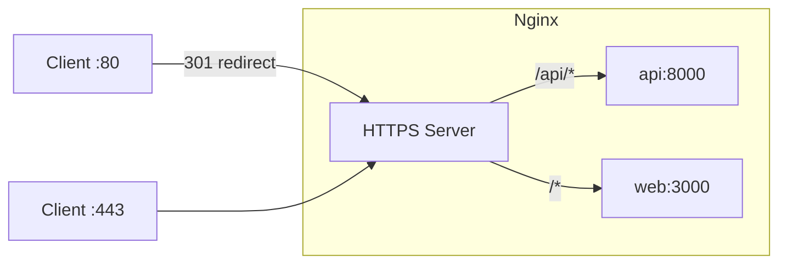

# Reverse Proxy (Nginx)

Nginx serves as the single entry point for all external traffic. It terminates TLS, routes requests to the API or frontend, and applies security headers.

**Key files**: `infra/nginx/nginx.conf` (production), `infra/nginx/nginx.dev.conf` (development), `docker-compose.yml` (nginx, certbot services)

---

## Production Configuration (`nginx.conf`)

### Routing



| Location | Upstream | Notes |
|----------|----------|-------|
| `/api/` | `http://api:8000` | Proxy buffering off, 300s read timeout (for SSE) |
| `/` | `http://web:3000` | WebSocket upgrade headers set (for HMR in case it leaks) |
| `/.well-known/acme-challenge/` | Filesystem | Certbot ACME challenge files |

### TLS

- Port 80 redirects all traffic to HTTPS (301)
- Certificates from Let's Encrypt at `/etc/letsencrypt/`
- Protocols: TLSv1.2, TLSv1.3
- Session cache: 10MB shared
- Session timeout: 1440 minutes
- Session tickets: disabled
- Cipher preference: client-side (modern browsers choose best)

### Security Headers

| Header | Value |
|--------|-------|
| `X-Frame-Options` | `SAMEORIGIN` |
| `X-XSS-Protection` | `1; mode=block` |
| `X-Content-Type-Options` | `nosniff` |
| `Referrer-Policy` | `no-referrer-when-downgrade` |
| `Content-Security-Policy` | `default-src 'self' http: https: data: blob: 'unsafe-inline'` |
| `Strict-Transport-Security` | `max-age=31536000; includeSubDomains` |

### Proxy Headers

Both upstreams receive these headers:

```nginx
proxy_set_header Host $host;
proxy_set_header X-Real-IP $remote_addr;
proxy_set_header X-Forwarded-For $proxy_add_x_forwarded_for;
proxy_set_header X-Forwarded-Proto $scheme;
```

The API upstream also has:
- `proxy_read_timeout 300s` — long timeout for SSE connections
- `proxy_buffering off` — required for SSE event streaming

The web upstream also has:
- `proxy_http_version 1.1` — needed for WebSocket upgrade
- `proxy_set_header Upgrade` / `Connection "upgrade"` — WebSocket passthrough

### Global Settings

| Setting | Value |
|---------|-------|
| `worker_processes` | `auto` |
| `worker_connections` | `1024` |
| `client_max_body_size` | `1g` |
| `sendfile` | `on` |
| `tcp_nopush` | `on` |
| `keepalive_timeout` | `65` |

The 1GB `client_max_body_size` matches the ClamAV `MaxFileSize` limit.

---

## Development Configuration (`nginx.dev.conf`)

Simplified version without TLS:

- **HTTP only** on port 80 (no HTTPS redirect, no certificates)
- **No security headers** (removed to avoid CSP issues during development)
- Same upstream routing (`/api/` to api, `/` to web)
- Same proxy headers and timeout settings

The dev compose overlay generates a self-signed certificate on startup:

```bash
openssl req -x509 -nodes -days 365 -newkey rsa:2048 \
  -keyout /etc/nginx/ssl/nginx.key \
  -out /etc/nginx/ssl/nginx.crt \
  -subj '/CN=localhost'
```

However, `nginx.dev.conf` only listens on port 80, so the self-signed cert is available but not actively used by nginx in dev mode.

---

## TLS Certificate Management

The `certbot` service is defined in `docker-compose.yml` but runs on-demand (not as a persistent service):

```yaml
certbot:
  image: certbot/certbot
  volumes:
    - ./infra/nginx/ssl:/etc/letsencrypt
    - ./infra/nginx/certbot-webroot:/var/www/certbot
```

### Initial Certificate

```bash
docker compose run certbot certonly --webroot \
  -w /var/www/certbot \
  -d yourdomain.com
```

### Renewal

```bash
docker compose run certbot renew
docker compose exec nginx nginx -s reload
```

The ACME challenge directory is served by nginx at `/.well-known/acme-challenge/` from `/var/www/certbot`.

---

## Docker Setup

```yaml
nginx:
  image: nginx:alpine
  volumes:
    - ./infra/nginx/nginx.conf:/etc/nginx/nginx.conf:ro
    - ./infra/nginx/ssl:/etc/letsencrypt
    - ./infra/nginx/certbot-webroot:/var/www/certbot
  ports:
    - "80:80"
    - "443:443"
  depends_on:
    - api
    - web
```

Nginx starts after both `api` and `web` are running (but does not wait for their health checks -- it relies on upstream health for actual request routing).
