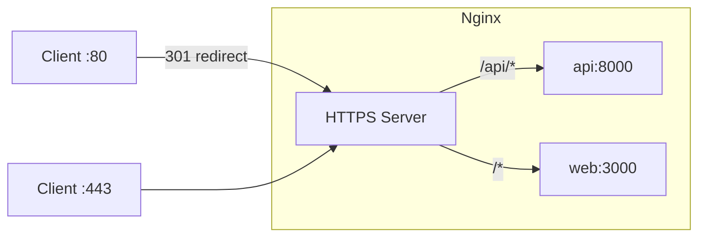

# Reverse Proxy (Nginx)

Nginx serves as the single entry point for all external traffic. It terminates TLS, routes requests to the API or frontend, and applies security headers.

**Key files**: `infra/nginx/nginx.conf` (production), `infra/nginx/nginx.dev.conf.template` (development template), `docker-compose.yml` (nginx, certbot services)

---

## Production Configuration (`nginx.conf`)

### Routing



| Location | Upstream | Notes |
|----------|----------|-------|
| `/api/` | `http://api:8000` | Proxy buffering off, 300s read timeout (for SSE) |
| `/` | `http://web:3000` | WebSocket upgrade headers set (for HMR in case it leaks) |

### File Storage

In production, file storage is served directly from **Cloudflare R2** via presigned URLs. The browser fetches files from the R2 custom domain (`files.yourdomain.com`), which goes through Cloudflare's CDN automatically. There is no `/s3/` proxy block in the production nginx config.

In development, the `nginx.dev.conf.template` still proxies `/s3/` to the local MinIO container for convenience.

### TLS

Production TLS is handled by **Cloudflare Tunnel** — nginx runs HTTP-only on port 80 and Cloudflare terminates TLS at the edge. No certificates are managed locally.

### Security Headers

Security headers are defined exclusively in the `server` block for port 443 (not at the `http` block level, which would cause inheritance confusion with `location` blocks).

**443 server block headers**:

| Header | Value |
|--------|-------|
| `X-Frame-Options` | `SAMEORIGIN` |
| `X-XSS-Protection` | `1; mode=block` |
| `X-Content-Type-Options` | `nosniff` |
| `Referrer-Policy` | `no-referrer-when-downgrade` |
| `Content-Security-Policy` | Strict policy (no `http://localhost:*` allowed) |
| `Strict-Transport-Security` | `max-age=31536000; includeSubDomains` |

**`/s3/` location sandboxed CSP**: The `/s3/` location block defines its own restrictive Content-Security-Policy to sandbox user-uploaded content:

```
default-src 'none'; style-src 'unsafe-inline'; sandbox;
```

All other security headers (`X-Frame-Options`, `X-XSS-Protection`, `X-Content-Type-Options`, `Referrer-Policy`, `HSTS`) are repeated in the `/s3/` location block because nginx drops inherited `add_header` directives when a `location` block defines its own `add_header`.

### Proxy Headers

The `/api/` and `/` upstreams receive these headers:

```nginx
proxy_set_header Host $host;
proxy_set_header X-Real-IP $remote_addr;
proxy_set_header X-Forwarded-For $proxy_add_x_forwarded_for;
proxy_set_header X-Forwarded-Proto $scheme;
```

The API upstream also has:
- `proxy_read_timeout 300s` — long timeout for SSE connections
- `proxy_buffering off` — required for SSE event streaming

The web upstream also has:
- `proxy_http_version 1.1` — needed for WebSocket upgrade
- `proxy_set_header Upgrade` / `Connection "upgrade"` — WebSocket passthrough

### Global Settings

| Setting | Value |
|---------|-------|
| `worker_processes` | `auto` |
| `worker_connections` | `1024` |
| `client_max_body_size` | `100m` |
| `sendfile` | `on` |
| `tcp_nopush` | `on` |
| `keepalive_timeout` | `65` |

The `client_max_body_size` must be >= `MAX_FILE_SIZE_MB` in `.env` (default 100 MiB).

### CORS Handling

In development, Nginx is configured to handle CORS preflight (`OPTIONS`) requests directly and ensure that required headers are present even when the backend is unreachable (e.g., 502 Bad Gateway).

- **Handling `OPTIONS`**: Nginx returns a 204 No Content with `Access-Control-Allow-Credentials: true` and appropriate methods/headers.
- **Proxied Requests**: Nginx adds CORS headers to the response and uses `proxy_hide_header` to prevent duplication with headers provided by the backend.

```nginx
# Example CORS handling for /api/
location /api/ {
    if ($request_method = 'OPTIONS') {
        add_header 'Access-Control-Allow-Origin' '$http_origin' always;
        add_header 'Access-Control-Allow-Credentials' 'true' always;
        # ... methods and headers ...
        return 204;
    }
    # ... proxy pass ...
    proxy_hide_header 'Access-Control-Allow-Origin';
    add_header 'Access-Control-Allow-Origin' '$http_origin' always;
}
```

### CORS Synchronization

The `Access-Control-Allow-Headers` value is defined once in `CORS_ALLOWED_HEADERS` (in `.env`) and consumed by both:

- **FastAPI** (`api/app/config.py`): Pydantic parses the comma-separated string into a `list[str]` for `CORSMiddleware`. This is authoritative in production and bare-uvicorn local dev.
- **Nginx** (`nginx.dev.conf.template`): The official `nginx:alpine` image's entrypoint substitutes `${CORS_ALLOWED_HEADERS}` at container start. This is authoritative in Docker dev (where Nginx strips backend CORS headers and injects its own).

Both sides have the same default (`Content-Type,Authorization,X-Client-ID,Accept,X-Requested-With`) so things work even without the env var set.

---

## Development Configuration (`nginx.dev.conf.template`)

Simplified version without TLS, rendered at container start via the official `nginx:alpine` image's built-in `envsubst` templating:

- **HTTP only** on port 80 (no HTTPS redirect, no certificates)
- **No security headers** (removed to avoid CSP issues during development)
- **Explicit CORS handling**: Managed at the Nginx level to support browser debugging (see [CORS Handling](#cors-handling)). The `Access-Control-Allow-Headers` value is injected from the `CORS_ALLOWED_HEADERS` environment variable, keeping it in sync with FastAPI's `CORSMiddleware` (see [CORS Synchronization](#cors-synchronization))
- Same upstream routing (`/api/` to api, `/` to web)
- Same proxy headers and timeout settings

### Container-to-Container Routing

In Docker, services use their container names for communication. The `web` container uses `API_INTERNAL_URL=http://api:8000` for server-side rewrites, ensuring reliable internal traffic separate from the browser's public-facing requests.

The dev compose overlay generates a self-signed certificate on startup:

```bash
openssl req -x509 -nodes -days 365 -newkey rsa:2048 \
  -keyout /etc/nginx/ssl/nginx.key \
  -out /etc/nginx/ssl/nginx.crt \
  -subj '/CN=localhost'
```

However, `nginx.dev.conf` only listens on port 80, so the self-signed cert is available but not actively used by nginx in dev mode.

---

## TLS Certificate Management

Production TLS is managed by **Cloudflare Tunnel**. The `cloudflared` daemon creates an outbound-only encrypted tunnel from your server to Cloudflare's edge network. No inbound ports (80, 443) need to be open.

Nginx runs HTTP-only on port 80 inside the Docker network, bound to `127.0.0.1:9080` on the host. Cloudflare Tunnel forwards traffic to this port.

---

## Docker Setup

```yaml
nginx:
  image: nginx:alpine
  volumes:
    - ./infra/nginx/nginx.conf:/etc/nginx/nginx.conf:ro
  ports:
    - "127.0.0.1:9080:80"
  depends_on:
    - api
    - web
```

Nginx starts after both `api` and `web` are running (but does not wait for their health checks -- it relies on upstream health for actual request routing).

---

## Deploying Behind an External Reverse Proxy

If you are using Cloudflare, Traefik, or an external Nginx instance to terminate SSL, you can simplify WikINT's internal configuration to run entirely on HTTP.

### 1. Update Internal Nginx
Modify `infra/nginx/nginx.conf` to remove the `443` server block, remove all SSL certificates, and run exclusively on port `80`. 

Crucially, ensure you pass the protocol from the outer proxy to the inner upstreams using the `$http_x_forwarded_proto` header so WikINT knows requests are actually secure:
```nginx
proxy_set_header X-Forwarded-Proto $http_x_forwarded_proto;
```

### 2. Update Docker Compose
In `docker-compose.yml`, remove the `certbot` service entirely. Update the `nginx` service to bind locally to a custom port (e.g., `9080`):
```yaml
  nginx:
    restart: unless-stopped
    image: nginx:alpine
    volumes:
      - ./infra/nginx/nginx.conf:/etc/nginx/nginx.conf:ro
      - ./infra/nginx/error-expired.html:/etc/nginx/html/error-expired.html:ro
    ports:
      - "127.0.0.1:9080:80"
    depends_on:
      - api
      - web
```

### 3. Outer Proxy Configuration (Example)
Your external reverse proxy MUST properly handle large uploads and Server-Sent Events (SSE) for WikINT to function correctly. 

Here is a typical Nginx configuration for the outer proxy:

```nginx
server {
   listen 80;
   server_name wikint.your-domain.com;
   return 301 https://$host$request_uri;
}

server {
   listen 443 ssl http2;
   server_name wikint.your-domain.com;
   
   ssl_certificate /path/to/cert.pem;
   ssl_certificate_key /path/to/key.pem;

   # 1. REQUIRED: Allow large file uploads (Matches MAX_FILE_SIZE_MB)
   client_max_body_size 100m;

   location / {
      proxy_pass http://127.0.0.1:9080;
      proxy_set_header Host $host;
      proxy_set_header X-Real-IP $remote_addr;
      proxy_set_header X-Forwarded-For $proxy_add_x_forwarded_for;
      
      # 2. REQUIRED: Tell WikINT the connection is secure
      proxy_set_header X-Forwarded-Proto $scheme;

      # Websocket support
      proxy_http_version 1.1;
      proxy_set_header Upgrade $http_upgrade;
      proxy_set_header Connection "upgrade";
   }

   # 3. REQUIRED: Disable buffering for the API (for SSE)
   location /api/ {
      proxy_pass http://127.0.0.1:9080/api/;
      proxy_set_header Host $host;
      proxy_set_header X-Real-IP $remote_addr;
      proxy_set_header X-Forwarded-For $proxy_add_x_forwarded_for;
      proxy_set_header X-Forwarded-Proto $scheme;
      
      # Disable buffering for real-time notifications to work
      proxy_buffering off;
      proxy_read_timeout 300s;
   }
}
```

**Note on Cloudflare:**
If proxying through Cloudflare, the `X-Real-IP` will be Cloudflare's IP. To ensure WikINT's rate limiting and audit logs function correctly, configure your outer Nginx to restore the real client IP using the `set_real_ip_from` directives and `real_ip_header CF-Connecting-IP;` in the `http { ... }` block.
