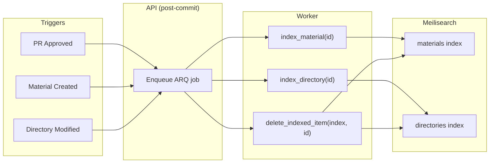

# Search Engine (Meilisearch)

WikINT uses Meilisearch v1.12 for full-text search across materials and directories. The search engine is configured programmatically on API startup and kept in sync via background worker jobs.

**Key files**: `docker-compose.yml` (meilisearch service), `api/app/core/meilisearch.py`, `api/app/workers/index_content.py`, `api/app/cli.py` (reindex command)

---

## Docker Configuration

```yaml
meilisearch:
  image: getmeili/meilisearch:v1.12
  environment:
    MEILI_MASTER_KEY: ${MEILI_MASTER_KEY}
  volumes:
    - meilisearch_data:/meili_data
  ports:
    - "7700:7700"
```

Configuration is done entirely via environment variables. The `infra/docker/meilisearch/config.yml` file is documentation-only.

---

## Index Setup

`api/app/core/meilisearch.py` — `setup_meilisearch()` runs on API startup (via the FastAPI lifespan) and ensures both indexes exist with the correct settings.

### Materials Index

```python
searchable_attributes = [
    "title",           # Highest priority
    "description",
    "tags",
    "slug",
    "type",
    "authorName",
    "ancestor_path",
    "extra_searchable", # Lowest priority — split identifiers
]
filterable_attributes = ["type", "directory_id"]
```

### Directories Index

```python
searchable_attributes = [
    "name",            # Highest priority
    "description",
    "slug",
    "type",
    "tags",
    "code",            # Module code (e.g., "NET4001")
    "ancestor_path",
    "extra_searchable", # Lowest priority — split identifiers
]
filterable_attributes = ["parent_id", "type"]
```

### Typo Tolerance

Both indexes share the same typo tolerance config:

| Setting | Value |
|---------|-------|
| Enabled | `true` |
| Min word size for 1 typo | 5 characters |
| Min word size for 2 typos | 9 characters |

---

## Document Structure

### Material Document

```json
{
  "id": "uuid",
  "title": "Exam NET4001 2024",
  "slug": "exam-net4001-2024",
  "description": "Final exam for networking course",
  "type": "pdf",
  "tags": ["exam", "networking"],
  "authorName": "Jean Dupont",
  "directory_id": "uuid",
  "created_at": "2024-01-15T10:30:00",
  "ancestor_path": "1A S1 NET4001",
  "extra_searchable": "Exam NET 4001 2024 1 A S 1 NET 4001",
  "browse_path": "/browse/1a/s1/net4001/exam-net4001-2024"
}
```

### Directory Document

```json
{
  "id": "uuid",
  "name": "NET4001",
  "slug": "net4001",
  "type": "module",
  "description": "Introduction to Computer Networking",
  "tags": ["networking"],
  "code": "NET4001",
  "parent_id": "uuid",
  "created_at": "2024-01-01T00:00:00",
  "ancestor_path": "1A S1",
  "extra_searchable": "NET 4001 NET 4001 1 A S 1",
  "browse_path": "/browse/1a/s1/net4001"
}
```

---

## Split Identifiers

The `split_identifiers()` utility (`api/app/workers/index_content.py:15`) improves search for mixed alphanumeric terms:

```python
"NET4001"  → "NET 4001"
"1A"       → "1 A"
"exam2024" → "exam 2024"
```

This is stored in `extra_searchable` so that searching "4001" matches "NET4001" and searching "NET" also matches.

---

## Indexing Pipeline



### Worker Functions

| Function | Signature | Behavior |
|----------|-----------|----------|
| `index_material` | `(ctx, material_id: UUID)` | Loads material with tags and author, builds document, upserts to `materials` index |
| `index_directory` | `(ctx, directory_id: UUID)` | Loads directory with tags, builds document, upserts to `directories` index |
| `delete_indexed_item` | `(ctx, index_name: str, item_id: str)` | Deletes a document from the specified index |

All three are registered as ARQ functions in `api/app/workers/settings.py` and dispatched via the post-commit job pattern.

---

## Reindexing

The CLI `reindex` command rebuilds all indexes from scratch:

```bash
docker compose exec api uv run python -m app.cli reindex
```

This:
1. Calls `setup_meilisearch()` to ensure indexes and settings exist
2. Loads all materials with tags and authors
3. Builds ancestor paths via recursive `get_directory_path()` queries
4. Upserts all material documents to the `materials` index
5. Repeats steps 2-4 for directories

Use after database restores, manual record edits, or if search results seem out of sync.

---

## Environment Variables

| Variable | Default | Description |
|----------|---------|-------------|
| `MEILI_MASTER_KEY` | `change-me` | Master API key for Meilisearch |
| `MEILI_URL` | `http://meilisearch:7700` | Internal Meilisearch endpoint |
