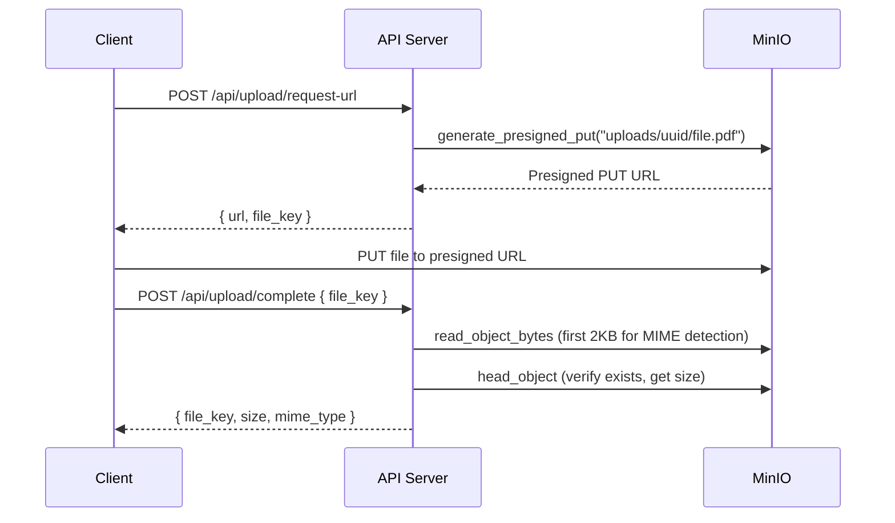

# File Storage (MinIO)

WikINT uses MinIO as an S3-compatible object storage backend for all uploaded files (materials, avatars, PR attachments). The API accesses it via the `aioboto3` library using the standard S3 API.

**Key files**: `docker-compose.yml` (minio, minio-setup services), `infra/docker/minio/setup.sh`, `api/app/core/minio.py`, `api/app/config.py`

---

## Docker Configuration

### MinIO Server

```yaml
minio:
  image: minio/minio:latest
  command: server /data --console-address ":9001"
  ports:
    - "9000:9000"   # S3 API
    - "9001:9001"   # Web console
  volumes:
    - minio_data:/data
```

### Bucket Initialization

The `minio-setup` service runs once after MinIO is healthy:

```bash
# infra/docker/minio/setup.sh
mc alias set local http://minio:9000 "$MINIO_ROOT_USER" "$MINIO_ROOT_PASSWORD"
mc mb --ignore-existing local/wikint
mc anonymous set download local/wikint
```

This creates the `wikint` bucket and sets its anonymous access policy to `download`, enabling direct browser access to files via presigned GET URLs.

---

## S3 Client

`api/app/core/minio.py` provides an async S3 client via aioboto3:

```python
@asynccontextmanager
async def get_s3_client() -> AsyncGenerator:
    async with _session.client(
        "s3",
        endpoint_url=f"{'https' if settings.minio_use_ssl else 'http'}://{settings.minio_endpoint}",
        aws_access_key_id=settings.minio_root_user,
        aws_secret_access_key=settings.minio_root_password,
    ) as client:
        yield client
```

The client is created per-operation as a context manager (no persistent connection pool for S3).

---

## Operations

| Function | Purpose |
|----------|---------|
| `generate_presigned_put(file_key, content_type, ttl=3600)` | Generate a PUT URL for client-side upload (1h default) |
| `generate_presigned_get(file_key, ttl=900)` | Generate a GET URL for download (15min default) |
| `object_exists(file_key)` | Check if an object exists (HEAD request) |
| `get_object_info(file_key)` | Get size and content type |
| `move_object(source_key, dest_key)` | Copy then delete (used when finalizing uploads) |
| `delete_object(file_key)` | Remove an object |
| `read_object_bytes(file_key, byte_count=2048)` | Read first N bytes (used for MIME magic byte detection) |
| `update_object_content_type(file_key, content_type)` | Update metadata via copy-in-place |

### Public Endpoint Rewriting

When `MINIO_PUBLIC_ENDPOINT` is set, presigned URLs have their internal hostname replaced with the public one. This is needed when MinIO is behind a reverse proxy or CDN with a different hostname.

---

## File Organization

Objects in the `wikint` bucket follow this key structure:

| Prefix | Content | Lifecycle |
|--------|---------|-----------|
| `uploads/` | Temporary client uploads (pre-validation) | Cleaned after 24h by `cleanup_uploads` cron |
| `materials/` | Finalized material files | Permanent (versioned) |
| `avatars/` | User profile pictures | Replaced on re-upload |
| `attachments/` | Material attachment files | Permanent |

---

## Upload Flow



The two-step presigned URL pattern means file bytes never pass through the API server -- they go directly from the browser to MinIO.

---

## ClamAV Integration

Virus scanning is performed via a separate ClamAV service (see [caching-and-queues.md](./caching-and-queues.md) for the scan timeout configuration). The scan happens during upload completion using the ClamAV TCP protocol on port 3310.

**Key files**: `api/app/core/clamav.py` (if present), ClamAV config at `infra/docker/clamav/clamd.conf`

### ClamAV Configuration

```
TCPSocket 3310
TCPAddr 0.0.0.0
MaxFileSize 1073741824       # 1 GB
MaxScanSize 1073741824       # 1 GB
StreamMaxLength 1073741824   # 1 GB
```

The 1 GB limits match the nginx `client_max_body_size` setting, ensuring any file that can be uploaded can also be scanned.

### Timeouts

Scan timeouts are configurable via environment variables:

| Variable | Default | Purpose |
|----------|---------|---------|
| `CLAMAV_SCAN_TIMEOUT_BASE` | 60s | Base timeout for any scan |
| `CLAMAV_SCAN_TIMEOUT_PER_GB` | 120s | Additional seconds per GB of file size |

---

## Environment Variables

| Variable | Default | Description |
|----------|---------|-------------|
| `MINIO_ROOT_USER` | `minioadmin` | MinIO admin username |
| `MINIO_ROOT_PASSWORD` | `minioadmin` | MinIO admin password |
| `MINIO_ENDPOINT` | `minio:9000` | Internal S3 API endpoint |
| `MINIO_PUBLIC_ENDPOINT` | `null` | Public-facing endpoint for presigned URLs |
| `MINIO_BUCKET` | `wikint` | Bucket name |
| `MINIO_USE_SSL` | `false` | Use HTTPS for S3 connections |
