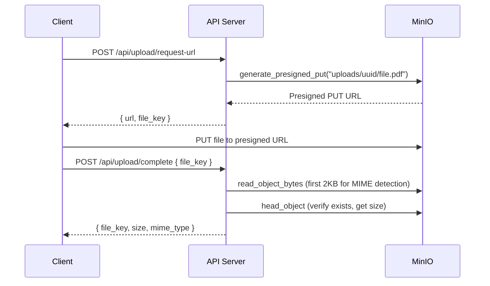

# File Storage (MinIO)

WikINT uses MinIO as an S3-compatible object storage backend for all uploaded files (materials, avatars, PR attachments). The API accesses it via the `aioboto3` library using the standard S3 API.

**Key files**: `docker-compose.yml` (minio, minio-setup services), `infra/docker/minio/setup.sh`, `api/app/core/minio.py`, `api/app/config.py`

---

## Docker Configuration

### MinIO Server

```yaml
minio:
  image: minio/minio:latest
  command: server /data --console-address ":9001"
  ports:
    - "9000:9000"   # S3 API
    - "9001:9001"   # Web console
  volumes:
    - minio_data:/data
```

### Bucket Initialization

The `minio-setup` service runs once after MinIO is healthy:

1. **Alias Setup**: Sets an internal alias for the MinIO server.
2. **Bucket Creation**: Creates the `wikint` bucket if missing.
3. **Privacy**: Sets the anonymous access policy to **none** (private).
4. **Global CORS**: Applies a global CORS policy to the MinIO instance using `mc admin config set local/ api cors_allow_origin="..."`. This is required for open-source MinIO versions to allow the frontend to perform multi-part uploads and authenticated fetches.

All file access must be performed via cryptographically signed URLs or authenticated API calls.

### Access & Proxying

While the API interacts with MinIO internally at `http://minio:9000`, client-side access (for downloads and previews) is routed through the Nginx reverse proxy at `/s3/`.

- **Internal Flow**: `API -> MinIO (9000)`
- **External Flow**: `Browser -> Nginx (:443/s3/) -> MinIO (9000)`

By proxying storage, we can intercept technical XML errors (like "Request has expired") and serve branded HTML error pages instead. See [reverse-proxy.md](./reverse-proxy.md) for details on error interception.

---

## S3 Client

`api/app/core/minio.py` provides an async S3 client via aioboto3:

```python
_s3_config = BotocoreConfig(signature_version="s3v4")

@asynccontextmanager
async def get_s3_client() -> AsyncGenerator:
    async with _session.client(
        "s3",
        endpoint_url=f"{'https' if settings.minio_use_ssl else 'http'}://{settings.minio_endpoint}",
        aws_access_key_id=settings.minio_root_user,
        aws_secret_access_key=settings.minio_root_password,
        region_name="us-east-1",
        config=_s3_config,
    ) as client:
        yield client
```

The client is created per-operation as a context manager (no persistent connection pool for S3).

> **SigV4 required**: MinIO dropped SigV2 support. All presigned URLs use AWS Signature Version 4 (`X-Amz-Algorithm=AWS4-HMAC-SHA256`). SigV4 signs the `host` header, so nginx **must** forward `Host: minio:9000` (matching the signing endpoint) to MinIO — not the client's original `Host` header.

---

## Operations

| Function | Purpose |
|----------|---------|
| `generate_presigned_put(file_key, content_type, ttl=3600)` | Generate a PUT URL for client-side upload (1h default) |
| `generate_presigned_get(file_key, ttl=900)` | Generate a GET URL for download (15min default) |
| `object_exists(file_key)` | Check if an object exists (HEAD request) |
| `get_object_info(file_key)` | Get size and content type |
| `move_object(source_key, dest_key)` | Copy then delete (used when finalizing uploads) |
| `delete_object(file_key)` | Remove an object |
| `read_object_bytes(file_key, byte_count=2048)` | Read first N bytes (used for MIME magic byte detection) |
| `update_object_content_type(file_key, content_type)` | Update metadata via copy-in-place |

### Public Endpoint Rewriting

When `MINIO_PUBLIC_ENDPOINT` is set, presigned URLs have their internal hostname replaced with the public one. This is needed when MinIO is behind a reverse proxy or CDN with a different hostname.

---

## File Organization

Objects in the `wikint` bucket follow this key structure:

| Prefix | Content | Lifecycle |
|--------|---------|-----------|
| `uploads/` | Temporary client uploads (pre-validation) | Cleaned after 24h by `cleanup_uploads` cron |
| `materials/` | Finalized material files | Permanent (versioned) |
| `avatars/` | User profile pictures | Permanent (replaced/deleted on update) |
| `attachments/` | Material attachment files | Permanent |

---

## Upload Flow



The two-step presigned URL pattern means file bytes never pass through the API server -- they go directly from the browser to MinIO.

---

## ClamAV Integration

Virus scanning is performed via a separate ClamAV service (see [caching-and-queues.md](./caching-and-queues.md) for the scan timeout configuration). The scan happens during upload completion using the ClamAV TCP protocol on port 3310.

**Key files**: `api/app/core/clamav.py` (if present), ClamAV config at `infra/docker/clamav/clamd.conf`

### ClamAV Configuration

```
TCPSocket 3310
TCPAddr 0.0.0.0
LocalSocket /tmp/clamd.socket
MaxFileSize 104857600        # 100 MiB — must match MAX_FILE_SIZE_MB
MaxScanSize 104857600        # 100 MiB
StreamMaxLength 104857600    # 100 MiB

# Zip-bomb & DoS Protection
MaxRecursion 16              # Max nested archive depth
MaxFiles 10000               # Max files per archive
MaxEmbeddedArchives 10MB     # Limit for embedded objects
AlertExceedsMax yes          # Fail-closed if limits are exceeded
```

These limits must match the `MAX_FILE_SIZE_MB` setting in `.env` (default 100 MiB) and the nginx `client_max_body_size`, ensuring any file that can be uploaded can also be scanned. The added recursion and file count limits protect the scanner from "zip-bombs" and decompression-based Denial of Service (DoS) attacks.

### Timeouts

Scan timeouts are configurable via environment variables:

| Variable | Default | Purpose |
|----------|---------|---------|
| `CLAMAV_SCAN_TIMEOUT_BASE` | 60s | Base timeout for any scan |
| `CLAMAV_SCAN_TIMEOUT_PER_GB` | 120s | Additional seconds per GB of file size |

---

## Environment Variables

| Variable | Default | Description |
|----------|---------|-------------|
| `MINIO_ROOT_USER` | `minioadmin` | MinIO admin username |
| `MINIO_ROOT_PASSWORD` | `minioadmin` | MinIO admin password |
| `MINIO_ENDPOINT` | `minio:9000` | Internal S3 API endpoint |
| `MINIO_PUBLIC_ENDPOINT` | `null` | Public-facing endpoint for presigned URLs |
| `MINIO_BUCKET` | `wikint` | Bucket name |
| `MINIO_USE_SSL` | `false` | Use HTTPS for **internal** S3 connections (keep false if using Docker network) |
