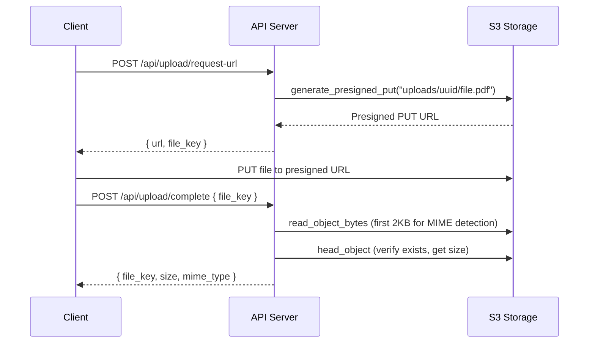

# File Storage (S3-Compatible)

WikINT uses S3-compatible object storage for all uploaded files (materials, avatars, PR attachments). In production, this is **Cloudflare R2**. In development, a local **MinIO** container is used. The API accesses storage via the `aioboto3` library using the standard S3 API.

**Key files**: `api/app/core/storage.py`, `api/app/config.py`, `docker-compose.dev.yml` (minio service for dev)

---

## Production: Cloudflare R2

In production, files are stored in a Cloudflare R2 bucket. R2 is S3-compatible with zero egress fees.

- **Endpoint**: `<account-id>.r2.cloudflarestorage.com`
- **Public access**: Via a custom domain (e.g., `files.yourdomain.com`) connected to the R2 bucket through Cloudflare, which provides CDN caching automatically.
- **Region**: `auto` (Cloudflare manages placement)

The browser uploads/downloads files directly via presigned URLs — file bytes never pass through the API server.

## Development: MinIO

In development (`docker-compose.dev.yml`), a local MinIO container provides S3-compatible storage:

```yaml
minio:
  image: minio/minio:latest
  command: server /data --console-address ":9001"
  volumes:
    - minio_data:/data
```

The `minio-setup` service runs once after MinIO is healthy to create the `wikint` bucket with private access (no anonymous access).

Client-side access in dev is routed through the Nginx reverse proxy at `/s3/`, which forwards to MinIO with the correct `Host: minio:9000` header for SigV4 signature validation.

---

## S3 Client

`api/app/core/storage.py` provides an async S3 client via aioboto3:

```python
_s3_config = BotocoreConfig(signature_version="s3v4")

@asynccontextmanager
async def get_s3_client() -> AsyncGenerator:
    async with _session.client(
        "s3",
        endpoint_url=f"{'https' if settings.s3_use_ssl else 'http'}://{settings.s3_endpoint}",
        aws_access_key_id=settings.s3_access_key,
        aws_secret_access_key=settings.s3_secret_key,
        region_name=settings.s3_region,
        config=_s3_config,
    ) as client:
        yield client
```

> **SigV4 required**: All presigned URLs use AWS Signature Version 4 (`X-Amz-Algorithm=AWS4-HMAC-SHA256`). In dev mode, nginx **must** forward `Host: minio:9000` (matching the signing endpoint) to MinIO. In production with R2, the browser accesses the R2 custom domain directly.

---

## Operations

| Function | Purpose |
|----------|---------|
| `generate_presigned_put(file_key, content_type, ttl=3600)` | Generate a PUT URL for client-side upload (1h default) |
| `generate_presigned_get(file_key, ttl=900)` | Generate a GET URL for download (15min default) |
| `object_exists(file_key)` | Check if an object exists (HEAD request) |
| `get_object_info(file_key)` | Get size and content type |
| `move_object(source_key, dest_key)` | Copy then delete (used when finalizing uploads) |
| `delete_object(file_key)` | Remove an object |
| `read_object_bytes(file_key, byte_count=2048)` | Read first N bytes (used for MIME magic byte detection) |
| `update_object_content_type(file_key, content_type)` | Update metadata via copy-in-place |

### Public Endpoint Rewriting

When `S3_PUBLIC_ENDPOINT` is set, presigned URLs have their internal hostname replaced with the public one. In production with R2, this rewrites R2's internal endpoint to your custom domain (e.g., `files.yourdomain.com`).

---

## File Organization

Objects in the `wikint` bucket follow this key structure:

| Prefix | Content | Lifecycle |
|--------|---------|-----------|
| `uploads/` | Temporary client uploads (pre-validation) | Cleaned after 24h by `cleanup_uploads` cron |
| `materials/` | Finalized material files | Permanent (versioned) |
| `avatars/` | User profile pictures | Permanent (replaced/deleted on update) |
| `attachments/` | Material attachment files | Permanent |

---

## Upload Flow



The two-step presigned URL pattern means file bytes never pass through the API server -- they go directly from the browser to S3 storage.

---

## ClamAV Integration

Virus scanning is performed via a separate ClamAV service. The scan happens during upload completion: the API fetches the file from S3 and streams it to ClamAV via the TCP protocol on port 3310.

### ClamAV Configuration

```
TCPSocket 3310
TCPAddr 0.0.0.0
LocalSocket /tmp/clamd.socket
MaxFileSize 104857600        # 100 MiB — must match MAX_FILE_SIZE_MB
MaxScanSize 104857600        # 100 MiB
StreamMaxLength 104857600    # 100 MiB

# Zip-bomb & DoS Protection
MaxRecursion 16              # Max nested archive depth
MaxFiles 10000               # Max files per archive
MaxEmbeddedArchives 10MB     # Limit for embedded objects
AlertExceedsMax yes          # Fail-closed if limits are exceeded
```

These limits must match the `MAX_FILE_SIZE_MB` setting in `.env` (default 100 MiB) and the nginx `client_max_body_size`, ensuring any file that can be uploaded can also be scanned.

### Timeouts

Scan timeouts are configurable via environment variables:

| Variable | Default | Purpose |
|----------|---------|---------|
| `CLAMAV_SCAN_TIMEOUT_BASE` | 60s | Base timeout for any scan |
| `CLAMAV_SCAN_TIMEOUT_PER_GB` | 120s | Additional seconds per GB of file size |

---

## Environment Variables

| Variable | Default | Description |
|----------|---------|-------------|
| `S3_ACCESS_KEY` | `minioadmin` | S3 access key (MinIO admin user or R2 API token key) |
| `S3_SECRET_KEY` | `minioadmin` | S3 secret key |
| `S3_ENDPOINT` | `minio:9000` | S3 API endpoint. MinIO: `minio:9000`, R2: `<account-id>.r2.cloudflarestorage.com` |
| `S3_PUBLIC_ENDPOINT` | `null` | Public-facing endpoint for presigned URLs |
| `S3_BUCKET` | `wikint` | Bucket name |
| `S3_REGION` | `us-east-1` | S3 region. MinIO: `us-east-1`, R2: `auto` |
| `S3_USE_SSL` | `false` | Use HTTPS for S3 connections (`false` for dev MinIO, `true` for R2) |
