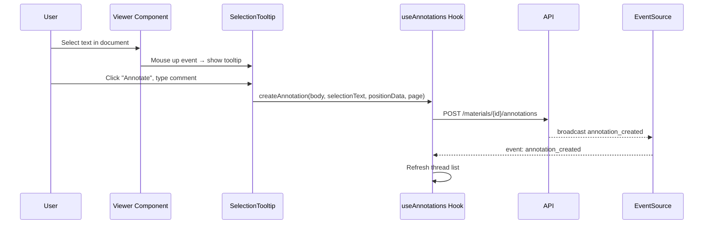

# Annotations (Frontend)

The annotation system lets users highlight text in documents and start threaded discussions. Annotations update in real-time via Server-Sent Events.

**Key files**: `web/src/hooks/use-annotations.ts`, `web/src/components/annotations/annotation-selection-tooltip.tsx`, `web/src/components/annotations/annotation-thread.tsx`, `web/src/components/sidebar/annotations-tab.tsx`

---

## Data Flow

---

## useAnnotations Hook

`web/src/hooks/use-annotations.ts` manages annotation state for a material:

**State**: `threads`, `loading`, `page`, `pages`, `total`

**Methods**:
| Method | API Call |
|--------|----------|
| `fetchAnnotations(page)` | `GET /materials/{id}/annotations?page=&limit=20` |
| `createAnnotation(body, selectionText?, positionData?, docPage?, replyToId?)` | `POST /materials/{id}/annotations` |
| `editAnnotation(id, body)` | `PATCH /annotations/{id}` |
| `deleteAnnotation(id)` | `DELETE /annotations/{id}` |

**Real-time**: Opens an `EventSource` to `GET /materials/{id}/sse`. Listens for:
- `annotation_created` → refreshes thread list
- `annotation_deleted` → refreshes thread list

Auto-reconnects after 5 seconds on error. Cleans up on unmount or when `materialId` changes.

---

## AnnotationSelectionTooltip

`web/src/components/annotations/annotation-selection-tooltip.tsx`

Appears when the user selects text in the document viewer:

1. **Mouse up** event handler checks for text selection within the container
2. If text is selected, shows a small button near the selection
3. Clicking expands into a textarea form
4. Captures: selected text, page number (from `data-page-number` attribute on the DOM element), position data (offsets)
5. On submit, calls the `onSubmit` callback with annotation data

Positioned absolutely near the selection. Dismissed on click outside.

---

## AnnotationThread

`web/src/components/annotations/annotation-thread.tsx`

Displays a single thread (root + replies):

- **Root annotation**: Shows highlighted `selection_text` with a left border, author info, body, timestamps
- **Replies**: Indented with a left border, showing author and body
- **Actions per annotation**:
  - Edit (if current user is author)
  - Delete (if author or moderator)
  - Reply (expands reply form)
  - Flag (if not author)

Also exports `AnnotationForm` — a textarea component used for composing new annotations and replies.

---

## AnnotationsTab

`web/src/components/sidebar/annotations-tab.tsx`

Sidebar tab (desktop only — hidden on mobile) that shows all annotation threads for the current material:

- Thread cards with pagination
- Reply and edit forms inline
- Empty state shows help text explaining how to create annotations
- Uses the `useAnnotations` hook for all data operations
