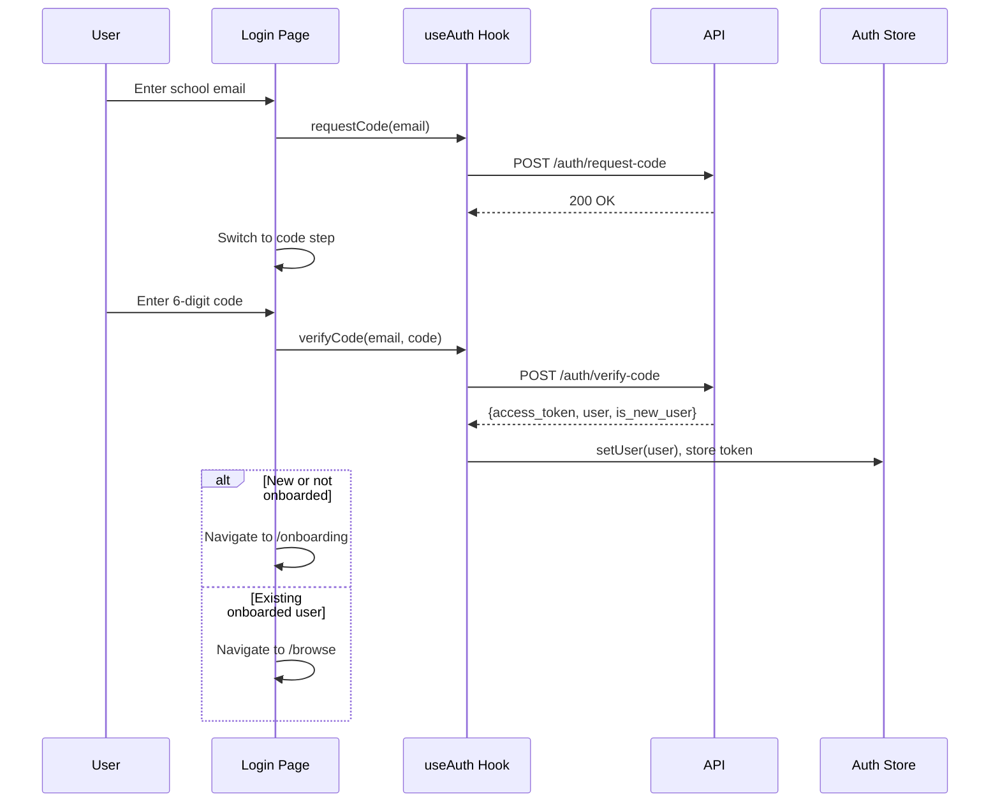

# Frontend Authentication

Authentication in the frontend is a multi-step flow: email entry, code verification, and onboarding for new users. Tokens are managed in localStorage with automatic refresh on 401 responses.

**Key files**: `web/src/app/login/page.tsx`, `web/src/app/onboarding/page.tsx`, `web/src/hooks/use-auth.ts`, `web/src/lib/auth-tokens.ts`, `web/src/lib/stores.ts`, `web/src/components/auth-guard.tsx`, `web/src/components/layout-shell.tsx`

---

## Login Flow

The login page (`web/src/app/login/page.tsx`) has two steps:
1. **Email step**: Input field with submit button. Shows link to Zimbra webmail.
2. **Code step**: 6-digit input. Option to return to email step.

### Automatic Redirect
If an already authenticated user visits the `/login` page, they are automatically redirected:
- To `/browse` if they are already onboarded.
- To `/onboarding` if they have not yet completed onboarding.

---

## Token Management

`web/src/lib/auth-tokens.ts`:
- `getAccessToken()` — reads from `localStorage["wikint_access_token"]`
- `setAccessToken(token)` — stores token
- `clearAccessToken()` — removes token

The API client (`web/src/lib/api-client.ts`) auto-injects the token as a `Bearer` header on every request. All three exported functions — `apiFetch` (JSON), `apiFetchBlob` (binary), and `apiRequest` (raw Response) — share this auth logic. On 401 responses, the client attempts a refresh via `POST /auth/refresh` (using the HTTP-only cookie). If refresh succeeds, it retries the original request with the new token. If refresh fails, it clears the token and throws.

---

## useAuth Hook

`web/src/hooks/use-auth.ts` provides:

| Method | API Call | Effect |
|--------|----------|--------|
| `requestCode(email)` | `POST /auth/request-code` | Sends verification email |
| `verifyCode(email, code)` | `POST /auth/verify-code` | Stores token, updates auth store, returns `{is_new_user}` |
| `logout()` | `POST /auth/logout` | Clears token, resets store |
| `fetchMe()` | `GET /users/me` | Refreshes user data; on 401, clears token and logs out |

---

## Route Protection

### AuthGuard (`web/src/components/auth-guard.tsx`)

Wraps protected pages. Props:
- `requireOnboarded: boolean` — if true, redirects to `/onboarding` for non-onboarded users

Behavior:
1. If not authenticated → redirect to `/login`
2. If `requireOnboarded` and not onboarded → redirect to `/onboarding`
3. While checking → shows loading spinner
4. Otherwise → renders children

### LayoutShell (`web/src/components/layout-shell.tsx`)

On mount:
1. Checks if access token exists in localStorage
2. If yes, calls `fetchMe()` to validate and load user data
3. If token is invalid (401), clears token and redirects to `/login`
4. Prevents content flash during auth check

---

## Onboarding

`web/src/app/onboarding/page.tsx` collects:
- **Display name** — text input
- **Academic year** — button group: 1A, 2A, 3A+
- **GDPR consent** — checkbox with link to privacy policy

All fields required. Submit calls `POST /users/me/onboard`, then `fetchMe()` to refresh state, then navigates to `/browse`.
