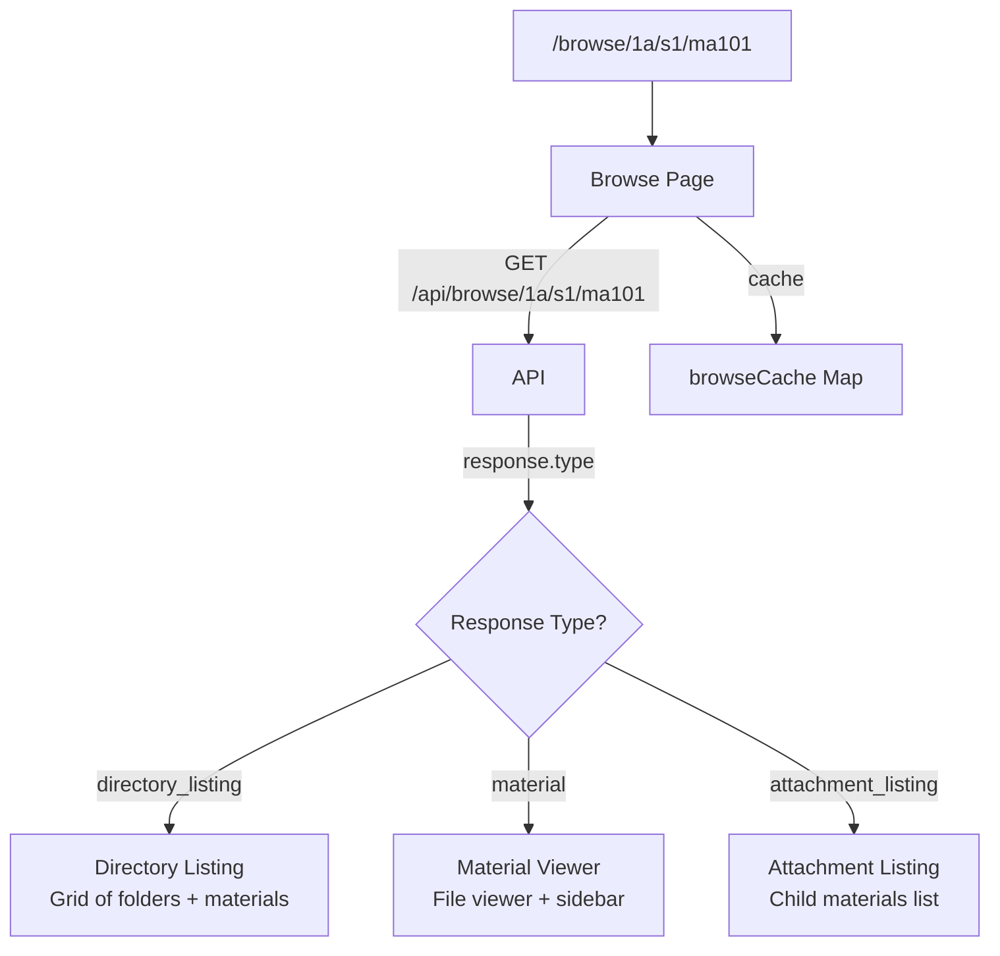

# Browse

The browse page is the main content navigation interface. It uses a catch-all route to resolve paths through the directory tree and displays directories, materials, and attachments.

**Key files**: `web/src/app/browse/[[...path]]/page.tsx`, `web/src/components/browse/breadcrumbs.tsx`, `web/src/components/browse/empty-directory.tsx`, `web/src/components/browse/directory-open-prs.tsx`, `web/src/components/browse/viewer-fab.tsx`

---

## Data Flow

The browse page (`web/src/app/browse/[[...path]]/page.tsx`) is wrapped in `AuthGuard` with `requireOnboarded`.

### Caching Strategy
- An in-memory `Map<string, BrowseResponse>` caches API responses by path
- On navigation, the cache is checked first before making an API call
- The previous path's data is used as a fallback during loading to prevent content flash

### Smart Loading Skeleton
The page uses an `isLikelyMaterial` heuristic (true if path has 3+ segments) to choose between a document-shaped skeleton (A4 proportioned paper) and a grid skeleton for directory listings.

---

## Directory Listing

When `response.type === "directory_listing"`, the page renders:

1. **Breadcrumbs** (`breadcrumbs.tsx`) — home icon + chevron-separated path. Last item is non-clickable text.
2. **DirectoryOpenPRs** (`directory-open-prs.tsx`) — amber alert showing open PRs affecting this directory. Fetched from `GET /api/pull-requests/for-item?targetType=directory&targetId=...`. Shows PR title, operation badges, vote score.
3. **Subdirectories** — cards/rows linking to child directories with counts
4. **Materials** — cards/rows linking to materials with type, download count, etc.
5. **EmptyDirectory** (`empty-directory.tsx`) — shown when directory has no children

---

## Material Viewer

When `response.type === "material"`, the page renders the material's file using the appropriate viewer component (see [Viewers](./viewers.md)).

The sidebar opens with the material as target, showing details, comments, annotations, edits, and actions.

## Global Drop Zone

The `GlobalDropZone` component (`web/src/components/pr/global-drop-zone.tsx`) listens for file drag events across the entire application.

- **Overlay**: When a file is dragged over the window, a full-screen blurred overlay appears prompting the user to "Drop files to upload".
- **Context Awareness**: If the user is currently browsing a directory, dropping files will automatically target that directory in the upload drawer.
- **Robustness**: The drop zone uses a synchronized counter to handle nested element transitions and correctly dismisses the overlay if the drag is cancelled or leaves the window.
- **Drawer Integration**: Upon dropping files, the `UploadDrawer` is opened with the files pre-staged and the appropriate directory context resolved.

### ViewerFab (`viewer-fab.tsx`)
Fixed bottom-right floating action buttons:
- **Download** (blue) — links to `/api/materials/{id}/download`
- **Upload Attachment** (violet) — opens upload drawer, visible if material is not an attachment
- **Attachments** (violet) — links to `{path}/attachments`, shows badge count
- **Flag** — opens flag dialog
- **Share** — copies URL to clipboard

---

## Sidebar Integration

On navigation to a material or directory, the page calls `useUIStore.openSidebar("details", target)` to populate the sidebar with contextual information. The sidebar closes on navigation between pages.
