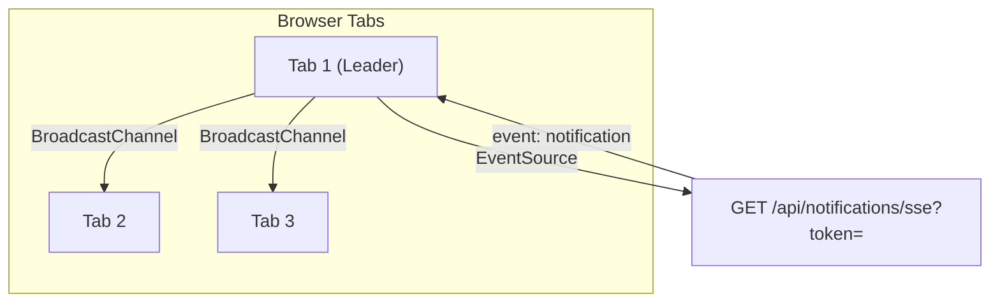

# Notifications (Frontend)

The notification system provides real-time updates via Server-Sent Events with multi-tab coordination. Notifications appear in the navbar bell icon and on a dedicated page.

**Key files**: `web/src/hooks/use-sse.ts`, `web/src/app/notifications/page.tsx`, `web/src/components/navbar.tsx`, `web/src/components/mobile-bottom-bar.tsx`, `web/src/lib/stores.ts`

---

## Multi-Tab SSE Architecture

The `useSSE` hook (`web/src/hooks/use-sse.ts`) uses the **BroadcastChannel API** to coordinate across browser tabs:

1. When a tab loads, it broadcasts a "ping" on the channel
2. If no "pong" comes back within a timeout, this tab becomes the **leader** and opens the `EventSource`
3. If another tab responds with "pong", this tab becomes a **follower** and listens via BroadcastChannel
4. The leader forwards all SSE events to the BroadcastChannel
5. If the leader tab closes, another tab will detect the absence and take over

This prevents duplicate SSE connections when multiple tabs are open.

### Initial Load
On first connection, fetches `GET /api/notifications?read=false&limit=1` to set the initial unread count.

### Event Handling
When a `notification` event arrives (via SSE or BroadcastChannel), `useNotificationStore.increment()` updates the badge count across all tabs.

---

## Navbar Integration

`web/src/components/navbar.tsx`:
- **Bell icon** with unread count badge (red dot with number)
- **Popover** on click: fetches 5 most recent notifications, shows them inline
- Each notification shows type icon, title, and relative timestamp
- "View all" link to `/notifications` page
- Badge hidden when count is 0

---

## Notifications Page

`web/src/app/notifications/page.tsx`:
- Fetches all notifications: `GET /api/notifications?limit=50`
- **Unread highlighting**: Colored icon background + blue dot indicator
- **Click to mark read**: `PATCH /api/notifications/{id}/read`
- **Mark all as read**: Button calls `POST /api/notifications/read-all`, visible only when unread notifications exist
- **Type-based icons**: Different Lucide icons per notification type
- **Relative timestamps** via date-fns
- **"View details"** link if notification has a `link` field
- Syncs unread count with `useNotificationStore`

### Notification Type Icons

| Type | Icon | Color |
|------|------|-------|
| `pr_approved` | CheckCircle | Green |
| `pr_rejected` | XCircle | Red |
| `pr_voted` | ThumbsUp | Blue |
| `annotation_reply` | MessageSquare | Purple |
| `pr_comment_reply` | MessageCircle | Blue |
| `flag_resolved` | Flag | Orange |
| `new_flag` | AlertTriangle | Yellow |

---

## Mobile Bottom Bar

`web/src/components/mobile-bottom-bar.tsx`:
- Fixed bottom navigation bar on mobile (hidden on desktop and when logged out)
- Three links: Home (/), Notifications (with badge), Profile
- Badge shows unread count from notification store
