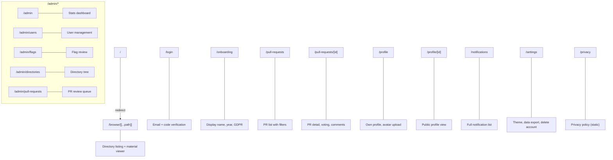

# Frontend Overview

The WikINT frontend is a Next.js 16 application using the App Router, React 19, TypeScript, and Zustand for state management. The UI is built with shadcn/ui components and Tailwind CSS.

**Key directories**: `web/src/app/` (pages), `web/src/components/` (components), `web/src/hooks/` (custom hooks), `web/src/lib/` (utilities and stores)

---

## Page Routing



---

## State Management

Five Zustand stores manage global client-side state:

### `useAuthStore` (`web/src/lib/stores.ts`)
- `user: UserBrief | null` — current user data
- `isAuthenticated: boolean`
- `isLoading: boolean`
- Actions: `setUser`, `setLoading`, `logout`

### `useUIStore` (`web/src/lib/stores.ts`)
- `sidebarOpen`, `sidebarTab`, `sidebarTarget` — sidebar state
- `searchOpen` — command palette visibility
- Actions: `openSidebar`, `closeSidebar`, `setSidebarTab`, `setSearchOpen`

### `useNotificationStore` (`web/src/lib/stores.ts`)
- `unreadCount: number` — drives badge displays
- Actions: `setUnreadCount`, `increment`

### `useStagingStore` (`web/src/lib/staging-store.ts`)
- `operations: StagedOperation[]` — queued PR operations (persisted to localStorage)
- `uploads: StagedUpload[]` — active upload progress (not persisted)
- `reviewOpen: boolean` — review drawer visibility
- Persisted to `localStorage["wikint-staging"]`

### `useSelectionStore` (`web/src/lib/selection-store.ts`)
- `selectMode`, `selected: Map`, `clipboard` — multi-select for bulk operations
- Actions: `toggle`, `selectAll`, `cut`, `reset`

---

## API Client

`web/src/lib/api-client.ts` provides three functions built on a shared `apiRequest()` core that handles Bearer token injection and 401 refresh:

| Function | Return Type | Use Case |
|----------|-------------|----------|
| `apiFetch<T>(path, options)` | `Promise<T>` (parsed JSON) | Standard API calls (most components) |
| `apiFetchBlob(path, options)` | `Promise<Blob>` | Binary file viewers (PDF, image, video, audio) |
| `apiRequest(path, options)` | `Promise<Response>` | When callers need the raw `Response` (text, arrayBuffer) |

Shared behavior:
- Base URL from `NEXT_PUBLIC_API_URL` (default `http://localhost:8000/api`)
- Auto-injects Bearer token from localStorage
- On 401: attempts token refresh via `POST /auth/refresh` (cookie-based), retries original request
- If refresh fails: clears token, throws `ApiError`
- Custom `ApiError` class with `status` and `message`
- `skipAuth` option for public endpoints

---

## Layout Structure

`web/src/components/layout-shell.tsx` wraps the entire application:

```
LayoutShell
├── Navbar (sticky top, search, notifications, user dropdown)
├── Main content (page routes)
├── Footer
├── GlobalFloatingSidebar (mobile sidebar overlay)
├── StagingFab (staged changes button)
├── ReviewDrawer (PR review sheet)
├── GlobalDropZone (drag-and-drop file overlay)
└── CookieBanner (GDPR consent)
```

On mount, LayoutShell checks authentication state, redirects to `/login` if token is missing or invalid.

---

## Component Library

UI primitives in `web/src/components/ui/` are from **shadcn/ui** (new-york style) built on Radix UI:

`accordion`, `avatar`, `badge`, `button`, `card`, `checkbox`, `confirm-delete-dialog`, `dialog`, `dropdown-menu`, `input`, `label`, `popover`, `progress`, `scroll-area`, `select`, `separator`, `sheet`, `skeleton`, `sonner` (toasts), `tabs`, `textarea`, `tooltip`

---

## Theming

- **Provider**: `next-themes` with `ThemeProvider` in root layout
- **Default**: Light theme, no system preference detection
- **Variables**: OKLch CSS custom properties in `web/src/app/globals.css`
- **Toggle**: Sun/Moon button on Settings page

---

## Responsive Design

Custom hooks in `web/src/hooks/use-media-query.ts`:

| Hook | Breakpoint |
|------|-----------|
| `useIsMobile()` | `max-width: 768px` |
| `useIsTablet()` | `769px - 1024px` |
| `useIsDesktop()` | `min-width: 1025px` |

Key responsive behaviors:
- Sidebar is a fixed panel on desktop, floating overlay on mobile
- Annotations tab hidden on mobile (uses inline annotations)
- MobileBottomBar shows navigation on small screens
- Tables hide non-essential columns on mobile
