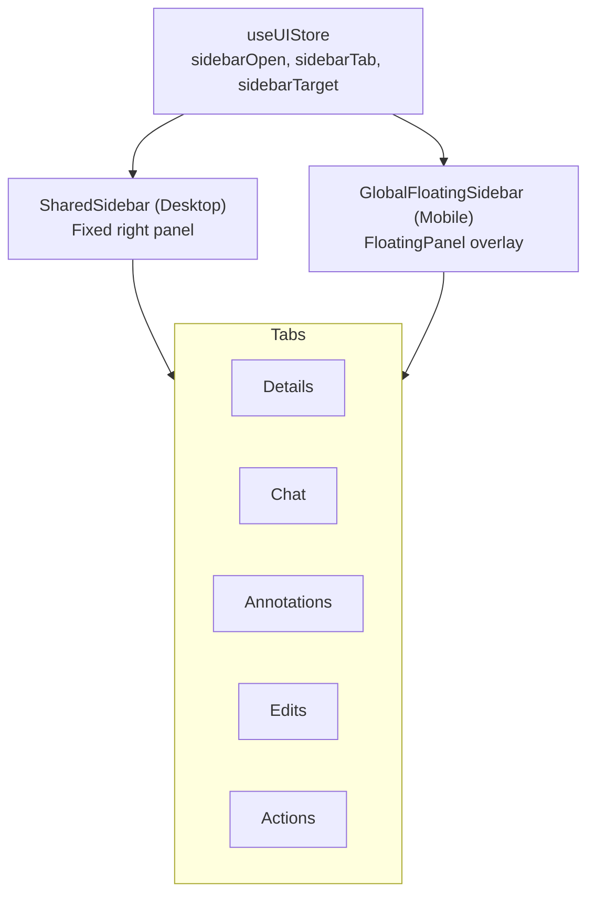

# Sidebar

The sidebar provides contextual information and actions for the currently selected material or directory. It has five tabs and adapts between desktop (fixed panel) and mobile (floating overlay).

**Key files**: `web/src/components/sidebar/shared-sidebar.tsx`, `web/src/components/sidebar/floating-panel.tsx`, `web/src/components/sidebar/global-floating-sidebar.tsx`, `web/src/components/sidebar/details-tab.tsx`, `web/src/components/sidebar/chat-tab.tsx`, `web/src/components/sidebar/annotations-tab.tsx`, `web/src/components/sidebar/edits-tab.tsx`, `web/src/components/sidebar/actions-tab.tsx`

---

## Architecture

### State (`useUIStore` in `web/src/lib/stores.ts`)
- `sidebarOpen: boolean`
- `sidebarTab: "details" | "edits" | "chat" | "annotations" | "actions"`
- `sidebarTarget: { type: "directory" | "material", id: string, data: object } | null`

Opened via `openSidebar(tab, target)` from browse pages, viewer FAB, etc.

### Responsive Behavior
- **Desktop** (`SharedSidebar`): Renders as a fixed panel alongside content
- **Mobile** (`GlobalFloatingSidebar` → `FloatingPanel`): Full-screen overlay with backdrop blur, close button, Escape key / click-outside to dismiss
- **Annotations tab**: Hidden on mobile (annotations use inline tooltip instead)

---

## Tabs

### Details Tab (`details-tab.tsx`)

**For materials**: Author link, file size, download count, created date, pill-based tags list, attachment card (with count and link)

**For directories**: Item count, difficulty rating (DifficultyDots component), syllabus link, exam format link, pill-based tags

Uses reusable `SidebarSection` and `MetaRow` sub-components for organized layout.

### Chat Tab (`chat-tab.tsx`)

General comment thread for the selected entity:
- Fetches comments via `GET /api/comments?targetType=&targetId=`
- Paginated display with chronological ordering
- Textarea input at bottom (Shift+Enter for multiline, Enter to submit)
- Edit/delete own comments inline
- Moderators can delete any comment
- Shows author avatar, name, and relative timestamp

### Annotations Tab (`annotations-tab.tsx`)

Desktop-only tab. See [Annotations](./annotations.md) for full details.

### Edits Tab (`edits-tab.tsx`)

Shows open pull requests affecting the selected item:
- Fetches from `GET /api/pull-requests/for-item?targetType=&targetId=`
- Renders `PRCard` components in a vertical list
- Empty state message when no active PRs

### Actions Tab (`actions-tab.tsx`)

Quick actions organized in groups:

**Quick Actions**: Download (via `useDownload` hook — opens presigned URL in new tab), Share (copies link)

**Editing**: Edit (opens EditItemDialog to stage changes), Delete (stages delete operation)

**Moderation**: Flag button (opens flag dialog)

**Version History** (materials only): Expandable `VersionHistoryList` sub-component that fetches and displays all versions from `GET /api/materials/{id}/versions`. Each version has a download button that uses the `useDownload` hook (`GET /materials/{id}/versions/{n}/download-url`).
